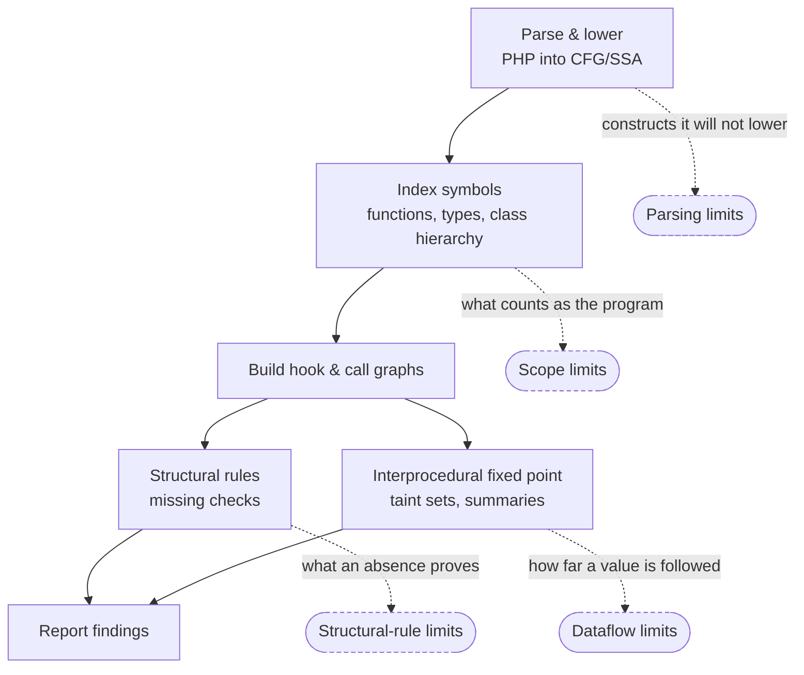
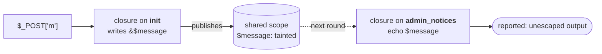

# Known limitations

Every static analyser is a pile of approximations. This file says which ones
wp-taint makes, so that a clean scan can be read for what it actually means
rather than for what you would like it to mean.

The design rule behind most of these: **prefer a documented false negative to an
undocumented false positive.** A tool that cries wolf gets muted and then
deleted, at which point its true positives stop mattering too.

A finding whose own source-to-sink path crossed one of these carries
`imprecise: true` in JSON output, `properties.imprecise` in SARIF, and a note
in the console naming the step it crossed. It is path-level: a finding is
imprecise only when a step on its own trace is, not when its function happened
to contain an unresolvable construct elsewhere. You can filter on it.

## Where each limitation comes from

Every approximation lives at one stage of the scan, and this file is organised
by stage. The diagram is the map: read a limitation as "this is what the engine
gives up at this box".



| Stage | Its limitations |
| --- | --- |
| Following a value across the program | [Dataflow](#dataflow) |
| Judging a missing check | [Structural rules](#structural-rules) |
| Turning source into a CFG | [Parsing](#parsing) |
| Deciding what counts as "the program" | [Scope](#scope) |

## At a glance

Two questions bring people here: **can it miss a real bug**, and **can it flag
safe code**. Each row answers both, and links to the reasoning. The direction
badge:

- **Misses**: it can stay quiet about a real bug.
- **Over-reports**: it can flag something safe.
- **Configurable**: a flag chooses which way it is wrong.
- **Neither**: the approximation is visible in the output, not in the findings.

**Dataflow**

| Limitation | Direction |
| --- | --- |
| [An array read or write with a computed key sees the whole array](#array-element-taint-is-per-key-when-both-ends-name-a-constant-key) | Over-reports |
| [A parameter read through more than 61 parts is read whole past them](#array-element-taint-is-per-key-when-both-ends-name-a-constant-key) | Over-reports |
| [Object properties are per class, not per instance](#object-properties-are-per-class-not-per-instance) | Over-reports |
| [A guard on a container is not followed](#a-guard-clause-is-followed-a-guard-on-a-container-is-not) | Over-reports |
| [A value of unknown origin, with `--no-unknown-provenance`](#unknown-provenance-is-reported-by-default) | Misses |
| [A context in a rebound or parameter-fed variable is not judged](#escaping-is-judged-against-its-context-but-not-a-computed-one) | Misses |
| [`wp_update_comment()` is listed as returning its filtered argument](#escaping-must-survive-to-the-point-of-output) | Over-reports |
| [Stored `unserialize()` needs a precondition the engine cannot check](#stored-object-injection-is-a-separate-lower-severity) | Neither |
| [`esc_sql()` outside a readable quote position](#esc_sql-is-only-credited-inside-quotes) | Misses |
| [`$_FILES['f']['tmp_name']` is treated as PHP's own path](#_files-sub-keys-are-phps-or-the-clients-not-all-one-thing) | Misses |
| [A sanitiser at input is credited at output](#a-sanitiser-at-input-is-credited-at-output) | Misses |
| [A CSV formula prefix spelled any other way](#the-csv-neutraliser-the-rule-asks-for-is-recognised-with-the-writer-that-keeps-it) | Over-reports |
| [Stored sources carry no `path` or `url` taint](#stored-sources-carry-html-and-sql-taint-only-not-path-or-url) | Misses |
| [An option write judged administrator-only through a caller the scan cannot see](#an-option-only-an-administrator-can-write-stores-nothing) | Misses |
| [An administrator's option write reached through a plugin's own hook, WP-CLI, cron or activation](#an-option-only-an-administrator-can-write-stores-nothing) | Over-reports |
| [A callable that cannot be traced to a name](#dynamic-calls-are-followed-as-far-as-the-value-can-be-traced) | Configurable |
| [Trait `insteadof` conflict resolution; a parent outside the scan](#inherited-methods-resolve-insteadof-and-out-of-scan-parents-do-not) | Over-reports |
| [A genuinely dynamic include path](#include-and-require-are-followed-unless-the-path-is-computed) | Misses |
| [A hook registration whose name will not resolve](#hook-callbacks-are-followed-unless-the-hook-name-is-dynamic) | Misses |
| [`remove_filter()` is not modelled](#hook-callbacks-are-followed-unless-the-hook-name-is-dynamic) | Over-reports |
| [A direct `$this->method()` call does not reach a subclass override](#a-callback-that-will-not-resolve-is-counted-not-guessed-at) | Misses |
| [An unmodelled function returns clean](#an-unmodelled-function-returns-clean) | Misses |
| [A by-reference call cannot clear its argument](#references-are-followed-and-never-cleared) | Over-reports |
| [A closure capture](#a-closure-capture-crosses-in-both-directions) | Neither |
| [A closure called by its maker cannot write back to the maker's later reads](#a-closure-capture-crosses-in-both-directions) | Misses |
| [What a REST callback returns is not treated as output](#a-rest-callbacks-return-is-not-output) | Misses |
| [A route's schema narrows a parameter only in the route's callback](#a-rest-parameter-is-read-through-its-routes-schema) | Over-reports |
| [`wp_json_encode()` is treated as clearing `html`](#wp_json_encode-context-sensitivity-is-approximated) | Misses |
| [Loops are not unrolled](#loops-are-analysed-to-a-fixed-point-not-unrolled) | Over-reports |

**Structural rules**

| Limitation | Direction |
| --- | --- |
| [An authorization check behind a genuinely unresolvable call](#permission_callback-is-checked-for-what-it-reaches-and-stays-quiet-when-unsure) | Misses |
| [A nonce alone satisfies the AJAX rule](#a-nonce-satisfies-the-ajax-rule-but-not-the-admin-post-one) | Misses |
| [A missing nonce stopped by something other than `isset()` or `empty()`](#a-bypassable-nonce-check-is-judged-by-what-a-missing-nonce-does) | Over-reports |
| [An option name anchored out of sight](#an-option-name-assembled-out-of-sight-is-assumed-to-be-anchored) | Misses |
| [An allowlist gate on an option name](#an-option-name-assembled-out-of-sight-is-assumed-to-be-anchored) | Over-reports |
| [`register_rest_route()` options built conditionally](#register_rest_route-options-are-folded-not-traced) | Neither |
| [A shortcode or block callback that is never registered](#a-printed-return-shortcode-handlers-and-block-renderers) | Misses |

**Parsing and scope**

| Limitation | Direction |
| --- | --- |
| [`eval`'d and generated code](#evald-and-generated-code-is-not-analysed) | Misses |
| [Code outside the scan path](#analysis-is-whole-program-and-a-plugin-is-the-natural-unit) | Misses |
| [A function declared twice: the union of both bodies](#duplicate-function-declarations-the-worst-of-both-wins) | Over-reports |
| [Six constructs are rewritten before analysis](#six-modern-constructs-are-lowered-before-analysis) | Neither |
| [No result cache](#there-is-no-result-cache) | Neither |
| [`--jobs` needs `pcntl`](#--jobs-needs-pcntl) | Neither |
| [The trace shown can depend on the order of analysis](#the-trace-shown-can-depend-on-the-order-of-analysis) | Neither |

**Not implemented**

[Second-order flows through a specific post- or user-meta key](#not-implemented),
and an HTML reporter. Option keys connect per key.

---

## Dataflow

### Array element taint is per-key when both ends name a constant key

```php
$context = [];
$context['title'] = $_GET['title'];
$context['id']    = 42;

echo $context['id'];      // not reported
echo $context['title'];   // reported
```

A write with a literal key goes to a slot of its own, and a read naming that key
sees only what went into it.

A read counts its key as constant when every value the key can hold is known:
a literal, a class or global constant, a join of those, or a `foreach` over a
literal list that nothing writes into. Such a read sees only those elements, so
`$o[ $k ]` inside `foreach ( array( 'path', 'tmpPath' ) as $k )` reads `'path'`
and `'tmpPath'` and nothing else. A write under such a key still goes under a
computed key, and an item of a list literal still sits under any index.

**It stops helping the moment either end is dynamic.** A write with a computed
key could land anywhere, so it goes to the whole-array slot; a read with a
computed key could be any key, so it sees everything, including every per-key
slot. Both are what the analysis did for all arrays before, and both are still
the fallback.

The slots cross a function boundary in both directions. A function that
returns an array hands its caller the elements, under the keys they were
written with. A function that reads a parameter only through literal keys
receives only those elements of the array it is handed:

```php
function acme_describe( $field ) {
    return array( 'tip' => $field['desc'] );
}

$field['value'] = get_option( 'acme_value' );
$parts = acme_describe( $field );
echo $parts['tip'];       // not reported: nothing reads $field['value']
```

A function whose result keeps its input's keys counts as a copy, so a callee
that reads `wp_parse_args( $args, $defaults )['title']` or the same through
`array_merge()` receives only `'title'`. A callee that uses the parameter any
other way receives every element. That includes passing it on to another
function, returning it, iterating it, or reading it with a computed key. So does a call written with `...$args`, and a
callback run by `array_map()`, by `call_user_func_array()` with an array not
written in the call, or by their relatives. None of those hands the parameter
one argument whose keys are the ones written. Type checks, `count()`, `isset()`, `empty()` and
comparisons read no content, so they do not count as a use.

A callback that `array_map()`, `usort()`, `uasort()` or
`call_user_func_array()` runs gets the values and not the keys, as PHP hands
them. One that `array_filter()`, `array_walk()` or `uksort()` runs can be
handed a key, so it gets both.

**Direction:** over-approximating at the dynamic ends, exact in the middle.

**Inside a function, an array keeps four levels of elements.** A literal, a
read, a join, an assignment and a copy keep each element apart. In
`$a = array( 'a' => array( 'id' => 'x', 'value' => get_option( 'y' ) ) )`,
`$a['a']['id']` is clean. A part deeper than four levels folds into its node,
which loses precision and never taint.

**A function's return and an include's scope keep four levels too.** A
function that returns the array above hands back `'a'` with `'id'` and
`'value'` apart, so the caller's `'id'` is clean. So does a callback
`array_map()` runs, under a computed key of the result, and so does a variable
an included file, a template's `$args` or a closure's capture reads.

**An array function keeps each element whole.** A function whose result keeps
its input's keys, such as `array_filter()` or `apply_filters()` on an array,
keeps each element under its string key, with what the element holds below
itself. An integer key can be renumbered, so its element joins the whole-array
slot, still whole. `array_values()` puts every element there. `reset()`,
`end()`, `array_shift()` and the functions like them return one element with
its parts, and `array_column()` returns each row's element under the column
key, with each row's index column as the keys. WordPress's `wp_parse_args()`
keeps each key as `array_merge()` does, and `wp_list_pluck()` reads one field
of each row as `array_column()` does. The elements fold into one set
in three cases:

- a function that builds something else, `implode( ',', $row )`
- a function that can undo escaping, `wp_unslash()` or `stripslashes_deep()`
- a function a dispatcher hands an array's items or whose returns it
  collects, `array_map( 'array_values', $rows )`, where the value it reads is
  a level below the argument

**Direction:** over-reports where the elements fold.

**An element the body never names travels with the others the body does not
name.** A summary knows the parts a function reads its parameter through. Under
each node it reads by literal key, one more part stands for every key it does
not name there. A caller's element under such a key reaches a loop, a computed
read, a flatten and a read under any other key, and comes back in what the
function returns. It does not reach a read of a key the body names. Those
elements come back as one set, though. So
`function acme_pick( $a ) { echo $a['title']; return $a; }` hands back
`array( 'title' => 'x', 't' => $_GET['t'], 'm' => 'x' )` with `'title'` clean
and `'m'` tainted. A function that names no key, `function acme_id( $a ) {
return $a; }`, hands everything back as one set, and so does one that includes
a file that reads the parameter. **Direction:** over-reports.

**A key carries its collection's own taint and what the code used as a key.**
A `foreach` key over `$_GET` is request data. After `$rows[ $_GET['k'] ] = 1`,
the `$k` in `foreach ( $rows as $k => $v )` is request data too, and `$v` is
not. `array_keys()` reads the keys the same way. `array_flip()`,
`array_combine()`, `array_fill_keys()` and `array_count_values()` use the
first array's values as the keys, and `array_flip()` the keys as the values.
`array_map()` over one array drops its keys, though PHP keeps them, so a key
read of its result is clean. **Direction:** misses.

**A summary keeps apart the parts a function reads a parameter through.** A
literal key, any element, and the keys are each a part, to four levels, and a
probe seeds each under its own number. A caller then hands each part of its
argument only what that part reached:

```php
function acme_attributes( $atts ) {
    $out = '';
    foreach ( $atts as $name => $value ) {
        $out .= ' ' . $name . '="' . esc_attr( $value ) . '"';
    }
    return $out;
}

echo acme_attributes( array( 'title' => $_GET['t'] ) );   // not reported
echo acme_attributes( array( $_GET['k'] => 'v' ) );       // reported
```

A loop that rebuilds an array under its own key, `$out[ $k ] = f( $v )`, keeps
each element under that key, and so does a function that rebuilds its parameter
that way. It follows the key through copies. A key built from the loop's key,
`$out[ $k . '_x' ]`, is a computed key, as before.

A parameter keeps up to 61 parts. Past that, and for a part the function reads
in a way this does not follow, the parameter's own taint stands for it, which is
what every part inherits. So does a callback `array_map()` and its relatives
run, and a function declared twice, whose two bodies number their parts apart.
**Direction:** over-reports.

### An element write into a property stops at the property

```php
$rows   = array();
$rows[] = array( 'title' => $_GET['t'] );
echo $rows[0]['title'];                 // reported

$a['x']['y'] = $_GET['v'];
echo $a['x']['y'];                      // reported

$this->opts['name'] = $_GET['n'];       // in one method
echo $this->opts['name'];               // in another: not reported
```

An element write into a local array reaches the array, however many keys deep,
and an array literal written into an element keeps its own elements. A write
into an element of a property still lands on a temporary that nothing reads
again. A property is one slot per class, so carrying the write up would give
every instance what one instance wrote: WooCommerce's report queries share one
clause list across every report. That waits for a design that tells instances
apart.

**Direction:** under-reports.

**An overwrite replaces the element only for a read in the same block.**

```php
$args['include'] = absint( $args['include'] );
echo $args['include'];                  // not reported
```

php-cfg keeps one operand for an array however many of its elements are
written, so a write joins the element it replaces. A read later in the same
block, with nothing between that touches the array other than another literal
key, sees exactly what the write left. A read after a branch that wrote the key
on one path still sees both. So does a function with a reference, a `global`
or `static`, an include, `extract()`, `parse_str()`, a dynamic call or a
variable variable, since a variable can change there without an op on its
operand. **Direction:** over-reports.

### Object properties are per class, not per instance

`Foo::$value` is one slot. Taint written to `$this->value` in any instance of
`Foo` is visible from every read of `$value` on any `Foo`.

Inheritance is followed: a write in the base class's constructor lands under
the base class's key, and a read through the subclass unions the whole chain,
the property is one storage slot on the instance whichever class's method
touched it. What stays approximate is the *instance* dimension, not the class
one.

A property on an object whose class the scan cannot tell has one slot per
name, shared across the whole scan. A read of `$obj->name` on any such object
sees every `->name` written on any other. The class is known for `$this`, an
object made with `new`, a declared parameter, property or return type, and a
value that one of PHP's own methods is declared to return. For a property,
that holds through a join when every way in agrees on the class, or brings a
literal, `null`, an array or a local nothing else can set. A value from a
function or method that declares nothing shares the slot.

A property keeps its value's elements apart, as a local array does, to four
levels. `$this->opts = array( 'name' => $_GET['n'], 'mode' => 'grid' )` in one
method makes `$this->opts['name']` tainted in another, and `$this->opts['mode']`
clean. So does a constructor that builds the array from its parameter, for each
caller's argument. An option stays one set: `get_option()` hands back all of
what was saved.

The trace does reach back to the source: the map records the trace of the write
that tainted a property, and a read splices it in ahead of its own step. Without
that, roughly a fifth of corpus findings had traces that began "read from
property `$x`" and stopped, which is not something a reviewer can act on.

**Direction:** over-approximating.

### A guard clause is followed; a guard on a container is not

```php
if ( ! ctype_digit( $id ) ) {
    return;
}
update_option( 'acme_id', $id );          // digits only by now
```

The engine keeps one taint state per function rather than one per block, which
is what makes its fixed point cheap, and that looked like it put this out of
reach. It did not. php-cfg already writes the answer into SSA: `is_int()` and
its relatives produce an `Assertion` op, and each branch gets its **own operand**
for the same variable, so the two paths were always distinguishable.
{@see AssertionNarrowing} reads it, and narrows only on a positive assertion to
a numeric or boolean type, `is_string()` proves nothing, since the dangerous
values are strings.

For the checks php-cfg does not assert on, `ctype_*`, `in_array( …, true )`,
`array_key_exists`, `preg_match`, a comparison with a literal, `empty()` and a
`switch` case, {@see GuardAnalyzer} computes **dominators**
over the block graph and asks whether the validating edge lies on every path to
the sink. It runs at reporting time and can only suppress a finding, never
create one, so no part of the fixed point changes and nothing can oscillate.

Both polarities are handled, and they are opposites: `ctype_digit()` proves
safety when it **succeeds**, `preg_match( '/[&<>"\']/' )` when it **fails**.
Conflating the two had the edge backwards. The second form matters more than it
looks, it is WordPress core's own `wp_specialchars()` fast path, so every
plugin vendoring a copy of it was reported until this existed.

A guard also narrows a value on the path that **returns** it, not only on the
path to a sink, which is the shape that fast path uses.

**What a guard reaches.** The check covers the value it tested, wherever it
dominates a use of it. The same name is not enough. A value written after the
check is not the one it checked, so it is reported:

```php
if ( empty( $title ) ) {
    $title = $_POST['fallback'];
    echo $title;                        // reported
}
```

A join of the tested value with a literal counts as the tested value, which is
the fallback form of an allowlist. A value computed from the tested one takes
the proof where it is computed, and keeps it through a join. The check covers:

- a variable, and an element under a literal key: `ctype_digit( $_GET['id'] )`
  covers a later `$_GET['id']`, and `in_array( $params['orderby'], … )` covers
  `$params['orderby']`
- a normalised copy, where the check and the use apply the same normaliser:
  `in_array( strtoupper( $dir ), … )` covers `strtoupper( $dir )`. The
  normalisers are `strtoupper`, `strtolower`, `trim`, `ltrim`, `rtrim` and
  `sanitize_key`.
- either side of `&&` and `||`, both ways. `isset( $x ) && ctype_digit( $x )`
  proves `$x` digits where it is true, and nothing where it is false.
  `'grid' === $mode || 'list' === $mode` proves `$mode` one of the two where it
  is true. `'grid' !== $mode && 'list' !== $mode` proves the same where it is
  false, which is the guard clause form.

**Comparisons.** `===` and `!==` with a literal or a constant hold the value to
that literal. A loose `==`, `!=` or `switch` case holds it only to a string that
is not numeric: `'1' == ' 1'`, and on PHP 7 `1 == '1<script>'`. So a case on a
number or a numeric string, or `== true`, proves nothing. `empty( $x )` holds
it to an empty value: `''`, `'0'`, `0`, `null`, `false` or an empty array. A
`match` is read as the `===` chain it is. A loose comparison against a constant
counts when the constant holds exactly one string that is not numeric:
`case self::DISMISS:` with `const DISMISS = 'acme_notice';`. A constant of
unknown value could be `true`, which every non-empty string loosely equals.

**What a guard proves, kind by kind.** A check against a fixed list of
literals, or a number check, leaves nothing but an object id. A character check
proves only what the characters it admits allow, the same proof a
`preg_replace()` strip gets:

- `ctype_digit()` and `/^[0-9]+$/` clear every payload.
- `/^[a-z0-9 ]+$/` clears HTML, and SQL inside quotes only. Outside quotes the
  space is enough for `1 OR 1`, so the value is `sql_unquoted` there, as if
  `esc_sql()` had run. A `-` counts the same way, because the query's own space
  after it can make `--` a comment.
- `! preg_match( '/[<>]/', $v )` clears nothing. The value can still carry a
  quote, and an echo may be inside an attribute or a script.
- `! preg_match( '/[<>"\']/', $v )` clears HTML. It gives what `esc_html()`
  gives: no markup in text and no way out of a quoted attribute. An `&` is
  allowed, because a character reference there is only a character.
- What a guard settles, it settles for the markers too. Digits written to an
  option are not an untrusted write, and digits echoed are not unknown output.
- A character check never settles a name. `ctype_alpha( $name )` before
  `update_option( $name, … )` is still an arbitrary option write.
- A pattern with the `m` or `x` modifier proves nothing: with `m`, `^` and `$`
  match at every line.

What survives goes with the value wherever it goes next. That covers assigning
it, `$query['orderby'] = $params['orderby']`, concatenating it into a query,
and passing it to a function, whose summary then sees what the guard admits.

One case is kept on purpose. An `html` sink can be anywhere in the page, so a
value that cannot hold `<`, `>` or a quote clears it, but a space can still
end an unquoted attribute: `echo '<div class=' . $v . '>'`. Crediting
spaces less would report every sanitised title echoed as text.

**Every way past the check has to be checked.** A block counts as guarded when
every edge into it is the side of a check that passed, or comes from a branch
that ended first: a `return`, `throw` or `exit`, or a call to `wp_die()`,
`wp_send_json()` and its variants, or `wp_nonce_ays()`. A branch that replaces
the checked variable with a literal counts too, since that is the fallback form
of an allowlist: `if ( ! in_array( $mode, … ) ) { $mode = 'grid'; }`. A branch
that does something else and falls through leaves the value unchecked:

```php
if ( ! ctype_digit( $x ) ) {
    $y = 1;            // falls through, never checked $x
}
echo $x;               // reported
```

A plugin's own function that always dies is not known to, so a guard clause
that calls one reports the value after it.

**What it will not claim.**

- **Loose `in_array()` is not a guard.** Type juggling smuggles values past it.
- **An allowlist it cannot read is not a guard.** `in_array( $id, array_keys(
  $definitions ), true )` constrains the value, and to what is not visible here.
- **A case that falls through from the one above is not credited.** Its block
  is entered from the case above as well as by its own. Cases written together
  with no body between them share one block, and are credited.
- **A write to an element after the check is not seen.** An element under a
  literal key is read afresh each time, and a write to it makes no new value.
  `in_array( $params['orderby'], … )` still covers a later `$params['orderby']`
  after `$params['orderby'] = $_GET['o']`.
- **A guard in one loop does not cover a sink in another.**

  ```php
  foreach ( $posted as $id => $v ) {
      if ( ! in_array( $id, $valid, true ) ) { continue; }
      $validated[ $id ] = $v;
  }
  foreach ( $validated as $id => $value ) {
      update_option( $id, $value );        // not dominated by the guard
  }
  ```

  Correctly not dominated: it is a different loop over a different array.
  Proving it safe means establishing that every write into `$validated` happened
  under a guard, which is a property of the array's contents rather than of
  control flow. That is container reasoning, not path sensitivity, and it is not
  done. WooCommerce's REST settings controller is the live example.

### Unknown provenance is reported by default

The engine has three answers for a value, tainted, clean, and *unknown*. The
third is reported at `low`, and `--no-unknown-provenance` turns it off.

A parameter of a function nothing in the scan calls, or the result of a callee
that cannot be followed, used to count as clean. That is a documented false
negative, taken on the grounds that an undocumented false positive is worse. It
costs more than it looked: a third-party suite scores the output half of this
tool at **0.18 recall** on exactly that shape, and turning the flag on takes it
to 0.82.

On by default because it is the question WordPress's own sanitise-on-input,
escape-on-output standard asks: is this value proven safe? It produces 157 more
findings across the fifty corpus plugins, all at `low`, which is below the
default `--fail-on` and so cannot fail a build on its own. A reader who knows
the value is safe dismisses one in a second; a reader who is never shown it
cannot.

It costs nothing to run. Seeding a marker on an entry point's parameters is not
extra work for the fixed point, and a 926-file scan measures the same either
way.

`--no-unknown-provenance` asks the narrower question, "can I trace this value to
something dangerous", and reports only what has a path.

The seeding is narrowed to entry points: a parameter of a function nothing in
the scan calls. A parameter whose callers *are* visible is not unknown, because
the caller answers for it and the scan read the caller. Marking every parameter
produced 926 findings, of which 784 were values whose provenance had already
been established.

Neither question is wrong. The flag says which one is being asked.

**A function whose output is already prepared is not affected.** VIP's guidance
that "some WordPress functions properly prepare the data for output" holds here
without a list of them, because two separate things have to be true before
either rule fires. `wp.output.unescaped-unknown` needs the marker to reach the
output, and `wp_get_attachment_image()`, `get_avatar()`, `wp_nav_menu()`,
`paginate_links()`, `get_search_form()` and the rest are not propagators, so
nothing carries through them. `wp.xss.escape-voided` needs evidence that
something *was* escaped before the filterable call, which echoing one of these
does not provide.

    echo wp_get_attachment_image( $id, 'large' );                    // silent
    echo get_avatar( $id );                                          // silent
    echo wp_get_attachment_image( $id, 'large', false,
        array( 'alt' => esc_attr( $title ) ) );                      // reported

Only the third reports, and only because an escaped value was handed in, which
is redundant, since core escapes those attributes itself.

### Escaping is judged against its context, but not a computed one

An escaper being present is not the same as it being the right one:

```php
echo '<script>var x = "' . esc_html( $v ) . '";</script>';   // ";alert(1);//
printf( '<a href="%s">x</a>', esc_attr( $url ) );            // javascript:...
printf( '<div data-v=%s></div>', esc_html( $v ) );           // x onmouseover=
```

This is a structural rule, not a dataflow one, because the context belongs to
the literal text around the hole rather than to the value: `esc_attr()` is right
in a quoted attribute, wrong in an `href`, and wrong again in an unquoted one.

A value between `<script` and its `>` is in an attribute rather than in a script
body, and attribute rules apply to it. Counting the bare `<script` as opening a
body asked for JavaScript escaping on an id and a URL, which would be wrong in
turn, `esc_js()` on a URL does not stop `javascript:`.

**What it judges beyond the inline spelling.** A context held in a variable
bound exactly once in the file folds to its binding, so `$tpl = '<a
href="%s">'; printf( $tpl, esc_attr( $u ) )` and the concat-then-echo spelling
are both judged. Positional `%1$s` specifiers map to their named argument,
there is nothing to guess.

**What it will not judge.** A variable bound more than once, or bound by
anything other than a plain assignment (a parameter, a `foreach`, a closure
`use`), one name, one binding, or the rule stays quiet rather than pick. A
format mixing bare `%s` with positional specifiers, whose sequencing is PHP
trivia. And a call it does not recognise as an escaper: `wp_get_referer()` is
a source, and accusing it of being the wrong escaper both misnames the problem
and duplicates the rule that already has it.

**`esc_url_raw()` is judged by the quote character.** Both it and `esc_url()`
run the same filter; the whole difference is the display-context block that
encodes the apostrophe. The character filter strips `"`, `<`, `>` and space in
both, and the scheme allowlist rejects `javascript:` in both. So only the quote
decides it:

```php
echo '<form action="' . esc_url_raw( $u ) . '">';   // safe: nothing can get out
echo "<form action='" . esc_url_raw( $u ) . "'>";   // reported: an apostrophe can
```

This was previously reported in both positions on the grounds that WordPress and
WPCS document `esc_url_raw()` as being for storage rather than output. That is a
style rule, and this file is about security: WP Super Cache writes the safe shape
32 times and being told all 32 were wrong is how a rule teaches people to stop
reading it.

### Output constructs carry three sinks each

`echo`, `print`, `printf`, `vprintf` and `var_dump` each report three separate
things about the same value: a traced flow to `html`, a value nothing vouches
for, and escaping a filter undid. `printf()` and its relatives had only the
first for a while, which cost two labelled true positives on a third-party
suite, one with the taint in the format string and one in an argument.

`wp_add_inline_script()` is an output construct too, and a JavaScript one: it
prints its argument inside a `<script>` block, so a single quote closes the
string literal and the rest is code. No HTML escaper protects it;
`wp_json_encode()` does.

**What is missed.** An output construct not in the catalogue. A template engine
that writes to the response itself, or a framework's own renderer, is invisible
unless it is added under `[[sinks]]`.

### A sanitiser at input is credited at output

```php
$q = sanitize_text_field( wp_unslash( $_GET['s'] ?? '' ) );
echo '<h2>Results for: ' . $q . '</h2>';        // not reported
```

`sanitize_text_field()` strips tags, so the value cannot carry HTML afterwards
and the echo is safe in a text context. The taint is cleared at the sanitiser
and nothing puts it back.

A stricter reading, WordPress's convention is to escape on output whatever was
done on input, and WPCS does not accept `sanitize_text_field()` as an output
escaper, would report it. Two labelled cases in a third-party suite expect
that, and they are counted as misses rather than argued with.

The reason for the looser reading is what it would cost. `sanitize_text_field()`
into a text context is among the most common correct lines in WordPress, and
reporting all of them buys nothing a reviewer can act on: the value provably
cannot carry a tag.

It is not the looser reading in an *attribute*, where the quotes
`sanitize_text_field()` leaves do matter, `" onmouseover=… x="` ends the value
and starts new attributes. That case has its own kind and its own sink:
tag-stripping sanitisers clear `html` and no longer clear `html_attr`, and
`wp.xss.unescaped-attribute` fires when a component carrying it lands inside a
quoted attribute, read off the literal fragments the way the SQL shape check
reads quote position. `esc_attr()` and the `esc_html()` family clear it (both
run ENT_QUOTES); `wp_kses_post()` does not, because kses passes markup and its
quotes through.

**What is still missed there.** An *unquoted* attribute, `value=<?php … ?>`,
where the space `sanitize_text_field()` also leaves is the breakout; the
structural rule reports it when an escaper is visible, but the dataflow sink
fires only for the quoted shape. And an output whose markup context is not
built where the echo is: a bare `echo $safe` may sit inside an attribute a
previous statement opened, and the statement in front of it shows nothing.

**Direction:** under-approximating at text contexts, deliberately; the quoted
attribute is now reported.

### Escaping must survive to the point of output

Escaping is called *late* escaping because it has to be the last thing that
happens to a value. Anything afterwards is another chance to undo it:

```php
$title = esc_html( $_GET['title'] );
echo apply_filters( 'acme_title', $title );   // any plugin may rewrite this
echo wp_trim_words( $title, 20 );             // 'wp_trim_words' runs inside
```

A plain taint model sees the escaper clear the taint and nothing put it back, so
it reports neither. An escaper now marks its result, a call that hands the value
to a third party trades that mark for `escape_voided`, and the output construct
reports it under its own rule at medium, one band below never having escaped at
all, because it needs a second plugin to actually hook the filter.

**Which calls void it is generated, not guessed.**
`tools/generate-filterable-catalogue.php` parses a WordPress checkout and lists
every function whose *return value* has been through `apply_filters()`, by
running a small fixed point over each body: a variable is filtered if it is
assigned from a filter or from anything mentioning an already-filtered variable.
Of 4,272 core functions, 933 mention a filter and **629 return one**. Naming
heuristics, anything starting `wp_` or `get_`, would have been a guess.

**Escaping after the filter clears the voiding**, because that is the correct
order: `wp_kses_post( apply_filters( 'x', esc_html( $v ) ) )` is safe however the
filter behaves.

**A merge cannot manufacture the pair.** The rule needs one value that was
escaped *and* then filtered, and a phi can produce that from two paths where
neither did both:

```php
if ( is_numeric( $media_id ) ) {
    $html = wp_get_attachment_image( $media_id, 'large' );   // voided, never escaped
}
if ( '' === $html && $url ) {
    $html = sprintf( '', esc_url( $url ) );    // escaped, never voided
}
echo $html;
```

The pair survives a merge only when one incoming operand carried both. That is a
merge rule rather than path sensitivity: it cannot say which path runs, only
that no single one of them did both things.

**One output line reports once for each flow.** When one echo gets more than
one of `wp.output.unescaped-unknown`, `wp.xss.unescaped-output` and
`wp.xss.escape-voided`, the more specific finding wins. Escape-voided wins over
unescaped-output, and either wins over unescaped-unknown. The usual shape is a
filter whose callback hands back raw input, and there the escape-voided
finding names both the defect and the fix.

A line never reports less than it holds. The specific finding wins outright
only when it is at least as severe. Otherwise:

- When both traces start at the same place, they tell one story at two
  severities. The specific finding stays and takes the higher severity, with a
  trace step saying so. A filter callback that appends raw input to an escaped
  value makes the value both voided and raw. The line reports escape-voided,
  which names the fix, at high.
- Otherwise they are two flows, and both stay. A request value that reaches an
  echo raw and a filtered option that reaches it voided report a high and a
  medium.

A finding's source is where its trace starts, to the column. Two different
flows that start at one call count as one story. `echo get_option( 'x',
esc_html( $_GET['v'] ) )` voids the escaped default and returns a stored value
raw, and the line reports one escape-voided finding at the stored value's
severity.

**Two deliberate exceptions.**

- **Registered escapers never void.** Core ends `esc_html()` with
  `return apply_filters( 'esc_html', $safe_text, $text )`, so the generated list
  contains it. Acting on that literally makes every escaper void its own work.
  A site with a hostile `esc_html` filter has a problem this rule cannot
  usefully report at each of ten thousand call sites.
- **Numeric coercion does not mark a value escaped.** `absint()` clears every
  kind, but coercing an id to an integer is not escaping content, and treating
  it as such made `echo get_the_title( absint( $_GET['id'] ) )` look like voided
  escaping because the *id* carried the marker into a call whose result has
  nothing to do with it.

**The list records which parameter the filtered value comes from**, because
"any escaped argument voids the result" is wrong in a way the corpus found
immediately:

```php
$comment['comment_author_url'] = esc_url( $_POST['url'] );
print( wp_update_comment( $comment ) );   // returns a row count, not the URL
```

`get_the_title( $id )` filters a title it fetched itself, so an escaped `$id`
never reaches the output. Only the parameters the filtered return actually
derives from can void anything.

**Known false positive.** `wp_update_comment()` is listed as returning its first
parameter filtered, because core contains:

```php
$data = apply_filters( 'wp_update_comment_data', $data, $comment, $commentarr );

if ( false === $data ) {
    return $data;
}
```

That `return` is only reachable when `$data` is `false`, so the function never
actually hands back the filtered string. Knowing that needs path-sensitivity,
which a generated list cannot have. It costs one finding on Akismet, the plugin
pinned to zero specifically to catch this kind of thing, which is the system
working even though the answer is wrong.

**Pluggable functions are covered too.** A plugin may redefine one outright
rather than filter it, which is a wider grant. The generated catalogue already
lists most of pluggable.php because those definitions happen to run filters
internally; `wp_text_diff()` is the one content-returning pluggable that does
not, and is curated in by hand. The rest return booleans, objects and voids,
nothing escaping could have been applied to.

**What is still missed.** A filter reached inside a function whose body the scan
cannot see.

### The CSV neutraliser the rule asks for is recognised, with the writer that keeps it

```php
$name = preg_replace( '/^([=+\-@])/', "'$1", $row['name'] );
fputcsv( $out, array( $name ), ',', '"', '' );   // not reported
fputcsv( $out, array( $name ) );                 // reported
```

A spreadsheet treats a cell beginning `=`, `+`, `-` or `@` as a formula, and
prefixing one with an apostrophe stops that. Asking for something and then not
crediting it when it is done is the same defect as advice that cannot be
followed.

One shape counts: anchored at the start, a class covering all four characters,
and a replacement whose *first* character is an apostrophe. `$1'` puts the
apostrophe after the `=` and neutralises nothing, so it still reports. A tab
or a space in front does not count. `trim()` removes either, and so do readers
that strip a cell's leading whitespace.

**The apostrophe counts only where every quote is doubled.** It covers the
cell's first character. `fputcsv()`'s default escape character is a backslash,
and a quote that follows one is not doubled. A spreadsheet reads that quote as
the end of the cell, so `x\",=HYPERLINK(…)` writes a second cell that starts
with `=`. The neutralised value carries `csv_prefixed`, and `fputcsv()` reports
it unless its fifth argument is the literal `''`. `"\0"` does not count: a NUL
before a quote leaves the same gap. The apostrophe crosses helpers both ways,
and a function that can take it off, `substr()` among them, turns the value
back into `csv`.

**What is missed.** Any other spelling, a `str_starts_with()` test and a
concatenation, a `substr()` check, an allowlist of known-safe values. Those
clear nothing and the finding stands. A named `escape: ''` argument is not
read, because the control flow graph keeps arguments by position only, so that
call reports too. **Direction:** over-reports.

### Stored object injection is a separate, lower severity

`unserialize()` on data from an option, post meta or a database row instantiates
whatever was stored there, so a POP chain in the loaded code runs. Three of the
pinned CVEs are exactly this, and the classic WordPress escalation is a
subscriber-level meta write turning into RCE.

It carries its own kind and its own rule at **high** rather than critical,
because it needs a precondition the engine cannot check: an attacker who can
write that store first. Reporting 91 corpus findings as critical alongside the
12 that need no precondition at all would devalue the word for both.

`unserialize( $data, [ 'allowed_classes' => false ] )` is not reported. That is
the documented fix for the class, it is what Better Search Replace shipped for
CVE-2023-6933, and flagging code that already applies it would be telling
people to do what they have done. The options array is read at the call site
only; a value built elsewhere counts as permitting objects, because being wrong
in the permissive direction would hide the bug.

Deliberately *not* extended to `path` or `url`: an attacker who can write an
option already has the access those sinks would give them. Object injection is
different because it grants more than the write did.

### `esc_sql()` is only credited inside quotes

`esc_sql()`, `wpdb::_real_escape()`, `wpdb::_escape()`, `addslashes()` and
`mysqli_real_escape_string()` escape quotes and backslashes. Inside quotes that
is a real defence; outside them there is nothing to escape and `1 OR 1=1`
reaches the database whole. So they do not clear `sql`; they trade it for
`sql_unquoted`, which the sink reports only when the value lands in an unquoted
position. `like_escape()` and `wpdb::esc_like()` escape only the LIKE wildcards
and the backslash, so they clear nothing.

**The concatenation that adds the quotes decides.** Each concatenation reads
its own text, through the concatenations and assignments that built it, and
tracks single quotes, double quotes and backticks. An escaped value inside a
quote the concatenation opens and closes is quoted there, and the result
carries `sql_self_quoted` instead: it brings its own quotes. That is safe where
it lands bare and unsafe inside more quotes, where its quotes close the outer
ones. So a clause built as `" AND name = '" . esc_sql( $n ) . "'"` and joined
into a query later is safe, however it got there.

A literal `sprintf()` format counts as text the same way, with each argument
where the format puts it, and a numeric conversion writes a number. An
`implode()` glue that leaves the quotes as it found them, such as `"','"`, keeps
the elements where the outer quotes put them. A glue the scan cannot read as
one string turns them back into `sql`: WooCommerce joins its tax-rate
locations with a glue built from a number and an escaped value, and that line
is reported. A fragment that is not written as
a literal still counts when it folds to exactly one string. One that folds to
several, or to none, is taken to hold no quote: `$c ? "'" : $x` could hold
anything.

**Identifiers and hand-written escapers.** A column or table name cannot go
through `prepare()`, so code escapes it for the backticks it will sit in.
`str_replace( '`', '``', $v )` doubles every backtick and removing them works
as well: the value is `sql_unticked`, safe inside backticks only. Inside
backticks the concatenation opens and closes, it is quoted there. Bare, or
inside quotes where a quote it holds gets out, it is reported. A
`str_replace()` that escapes the backslash first and then both quote
characters is credited like `esc_sql()`. One that escapes the quotes first, or
only one of them, gets no credit.

**A name the request chooses is its own finding.** Escaping keeps an
identifier one identifier. It does not stop the request choosing which, and
`user_pass` is as easy to name as `post_title`. A request value inside
backticks is reported as `wp.sqli.identifier-choice`, at medium, unless a
check against a fixed list settles it. On a line that already reports an
injection, the injection stands for it. A bare name, `ORDER BY $col` after
`sanitize_key()`, is not reported: bare, a value of digits is a number rather
than a name, and the scan does not keep which characters a value can hold.

**Only some functions keep the escaping.** A value keeps `sql_unquoted` or
`sql_self_quoted` through a propagator the catalogue marks `keeps_residuals`:
the case functions, `trim()` without a mask, `strval()`, the array functions
that copy their elements, and the `apply_filters()` family. Anything else can
undo the escaping, so the value is `sql` again after it: `stripslashes()`,
`rawurldecode()`, `substr()`, `trim( $v, '\\' )`, every PHP function from the
generated catalogue and every call the scan cannot resolve.

**Across a call.** A helper that escapes its argument hands the caller the
residual it made, so `function q( $v ) { return esc_sql( $v ); }` used unquoted
is reported. A callee that puts its argument into a query records where: bare,
or inside quotes. A caller passing an escaped value to the bare position, or a
self-quoted one to the quoted position, gets the finding at the callee's query.
A helper that returns an escaped argument as it came hands it back escaped. One
that may undo the escaping on the way, such as `stripslashes()`, hands it back
as `sql`. That record follows the parameter's own data, so a helper that
unslashes other request data has not undone the escaping of what it was
handed. It is per parameter, not per path: a helper that unslashes one copy of
its argument hands every copy back raw, even one it returned untouched.

**What is missed.** A caller that escapes a value and a callee that adds the
quotes: the callee's summary is built from `sql` and cannot see the quotes it
adds around an escaped value, so the caller's value still reads as unquoted.
UpdraftPlus's `escape_table_name()` is this shape: it doubles the backticks and
a second function adds them. Its catalogue entry says what it returns, one
quoted identifier, with `self_quoted = true`. An escaper written in one
function is read from its body, as Yoast's ORM is. A name inside backticks a
callee adds is not seen as a choice: the caller's query holds it bare. A
quote left open at the end of one concatenation and closed by a later one
across a branch merge. A quote inside an SQL comment, which is read as opening
a string. A query that reaches the sink whole, not as a concatenation, carrying
`sql_unquoted`: its position cannot be read.

### `$_FILES` sub-keys are PHP's or the client's, not all one thing

```php
file_get_contents( $_FILES['import']['tmp_name'] );   // not reported
copy( $upload['tmp_name'], WP_CONTENT_DIR . '/' . $_FILES['import']['name'] );  // reported
```

PHP writes `tmp_name`, `size` and `error` itself. `tmp_name` is a path under
`upload_tmp_dir` that the client never chose, and reading it is the only way to
read an upload at all. The client chooses `name`, `type` and `full_path`, and
those stay tainted.

`sub_keys` on a `[[sources]]` entry says which second-level keys are the
attacker's, for a superglobal whose first level is a name the code picks. Only
`$_FILES` has that shape; `$_SERVER`'s `keys` allowlist works one level up and
could not express it.

The read is followed through plain assignments, because the two-statement
spelling is as common as the one-expression one:

```php
$csv = $_FILES['subsidy_csv'];
$this->generate_zip( $csv['tmp_name'] );
```

**What is missed.** Assignments and branch merges only. A value merged from two
branches is followed when *every* branch reaches a qualifying superglobal fetch:
two `$_FILES` entries merge safely; one `$_POST` branch disqualifies the phi. A
value carried through a function is not followed: the base has to reach the
superglobal fetch inside one body. A computed second-level key stays tainted,
the same way `keys` treats one: someone who chooses the index chooses the
value.

**Direction:** under-approximating at `tmp_name`, deliberately.

### Stored sources carry HTML and SQL taint only, not path or url

`get_option()`, `get_post_meta()` and the rest are modelled as introducing
`html`, `html_attr` and `sql`. They are deliberately **not** modelled as
introducing `path` or `url`.

Stored XSS and second-order SQL injection are real and common. "An option holds
a directory name, therefore every `unlink()` downstream is path traversal" is
not: an attacker who can write arbitrary options already has the access those
sinks would give them. Modelling it that way produced several hundred findings
on the corpus with no plausible attack behind any of them.

The exception is a key the scan watched being written: `update_option(
'acme_tpl', $request )` makes `get_option( 'acme_tpl' )` carry the write's
*full* kinds, path and url included, with the write in the trace. That is
not an assumption about what an option might hold; it is the flow, both ends
visible. The whole value is stored, so an array's elements count too. A write
only an administrator can make stores nothing: see the next section.

**Direction:** under-approximating, deliberately, at keys the scan never saw
written. If a codebase really does let a low-privilege user write a path into
an option outside the scanned tree, add a project-local `[[sources]]` entry
with `kinds = ["path"]`.

### An option only an administrator can write stores nothing

A write only an administrator can make stores nothing in the option. A later
`get_option()` of it carries what stored data always carries, and no `url`,
`path` or `shell`. Administrators are trusted in WordPress. An administrator
who saves a redirect target on a settings page and is later sent there has
attacked nobody.

```php
function acme_settings_page() {                  // add_options_page( …, 'manage_options', … )
    update_option( 'acme', array( 'target' => $_POST['url'] ) );
}

add_action( 'wp_ajax_nopriv_acme_save', function () {
    update_option( 'acme', array( 'target' => $_POST['url'] ) );   // anyone: stored
} );

$settings = get_option( 'acme' );
wp_redirect( $settings['target'] );              // reported only for the second write
```

A write is administrator-only when every way the scan can see to it passes a
check that the caller holds a site-wide grant. That is a capability the
`[[capabilities]]` catalogue calls `site`, such as `manage_options`, or a
plugin's own capability. The check can be any of these:

- a `current_user_can()` check that dominates the write, or dominates the call
  or include that leads to it
- the admin page the code runs on, registered with such a capability through
  `add_menu_page()`, `add_submenu_page()`, `add_options_page()` or another
  `add_*_page()` wrapper
- a REST route whose every permission callback allows a request only behind
  such a check

A helper is judged by every path to it. A helper that saves settings is
administrator-only when each of its callers is, or calls it behind a check. A
second caller on `wp_ajax_nopriv_` makes it open. When the value comes in
through a parameter, each call site decides for what it passes.

Three checks never count: a nonce, a role capability such as `edit_posts` or
`upload_files`, and an object capability such as `edit_post` with its id. An
author passes the last one for their own posts, and a subscriber holds a valid
nonce for every form they can see.

Some of this is on the suppressing side:

- **A caller the call graph cannot see is not counted.** A helper reached from
  a `manage_options` page, and also from a call the scan could not resolve, is
  treated as administrator-only.
- **The capability check's generosities apply.** A computed capability counts,
  and so does an admin page whose capability will not fold. A helper counts
  when the call graph shows it reaching a capability check, whichever
  capability it checks. For a method call on an object of unknown class, one
  method of that name that reaches a check is enough. A call the graph knows
  nothing about counts when its name reads like a check. See
  [Object authorization](#object-authorization-is-a-scope-check-not-proof-the-check-is-right).
- **Editors hold some site-wide grants.** `edit_others_posts`,
  `moderate_comments` and `manage_categories` are `site` in the catalogue, so a
  write behind one of them is treated as an administrator's.

Some is on the reporting side:

- **A hook callback is an entry point, whoever fires the hook.** A plugin's
  own action, fired only from its settings page, still counts as one. The scan
  cannot tell it apart from a core hook the plugin fires again. WooCommerce's
  setup wizard fires `admin_enqueue_scripts` itself, and WordPress fires it on
  every admin page. So what the callback reads itself is stored. What the
  dispatch hands it is judged at the dispatch.
- **Some entry points cannot be tied to a capability, so they count as open.**
  These are WP-CLI commands, cron events, activation and uninstall hooks, a
  `load-{$page}` callback and `uninstall.php`. A write only an administrator
  can reach through one of them is still stored.
- **A check that ends the request inside a helper is not a guard.** Astra
  Sites calls `Helper::verify_ajax_request( 'manage_options' )` as a statement,
  and the helper stops the request unless the caller holds the capability.
  Only a branch on the check counts, so a write after that call is open.
- **What a reachable write carries is still the property model's.**
  Redirection's `Red_Options::save()` can be reached from the front end,
  through a database version upgrade. The `url` on its write comes from
  `Redirection_IP::$ip`, which a front-end request fills from `$_SERVER`. See
  [Object properties are per class](#object-properties-are-per-class-not-per-instance).

**Direction:** both, as listed.

### Dynamic calls are followed as far as the value can be traced

```php
$callback = $_GET['action'] === 'x' ? 'render_x' : 'render_y';
$callback( $value );                       // both, unioned
call_user_func( array( $this, 'run' ), $v ); // resolved
array_map( 'esc_html', $items );             // a real sanitizer application
```

What resolves: a callable that traces back to a literal string, a phi of
literals, a concatenation of resolvable parts, an `array( $object, 'method' )`
pair, a class-name pair, a closure, or an object with `__invoke`. Calls made on
your behalf by `call_user_func()`, `call_user_func_array()`, `array_map()`,
`usort()` and the rest resolve to the callee, not to the dispatcher; the list
lives under `[[dispatchers]]` in the catalogue, so a project can add its own.
A callable that resolves to several names reaches all of them and the effects
are unioned, because picking one would be a guess.

A callable read from a property resolves when every readable write to that
property agrees, `$this->handler = 'acme_render'` in the constructor,
`call_user_func( $this->handler, … )` in another method, inheritance included.
A property whose writes disagree, or hold anything but a literal string or
`array( $this|'Class', 'method' )` pair, stays unresolved.

What does not: a callable arriving as a parameter, or returned by a call the
engine cannot see into. A name that resolves to a function nobody can find a
body for also counts as unresolved, rather than resolving to nothing and
reporting clean.

**Direction:** configurable, because there is no correct answer, only a choice
about which way to be wrong.

| `--dynamic-calls` | An unresolved call | Wrong when |
| --- | --- | --- |
| `clean` | returns nothing tainted | the callee passes its arguments through |
| `propagate` *(default)* | passes its arguments to its return value | the callee escapes them |
| `tainted` | returns everything tainted | almost always, deliberately |

Under `propagate` and `tainted`, an unresolved call may also write back. The
arguments' taint is added to every argument that names a variable, since any of
them could be a by-reference parameter, and to a method's receiver, whose state
the callee could have changed; the receiver is an input to the return as well.
All of that applies only where nothing about the callee can be seen: a callable
whose name is unknown, `$cb()`, `new $class()`, a computed method name on a
receiver of unknown class, or a method no class in the scan declares. Two cases are narrower, because the scan can
answer them:

- **A method the scan can name candidates for** is one of them: a named method
  on an untyped receiver is one of the methods of that name, and a computed name
  on a receiver of known class is one of that class's methods, narrowed by the
  name's literal prefix. It writes back only through a position some candidate
  takes by reference, and its receiver is neither written nor read: that shape is
  nearly always a lookup, and `$form = wpcf7_contact_form( $_POST['id'] );
  echo $form->title();` would otherwise make a stored title as attacker-chosen
  as the id that found it.
- **A callable a dispatcher runs**, `call_user_func( $cb, $a, $b )` and the rest,
  gets copies of its arguments, so nothing is written back.
  `call_user_func_array()` can pass references held in the array itself; that
  shape is rare and not modelled.

`propagate` is the default because an unresolved callee is nearly always code
in the same project, and code in the same project transforms its arguments
rather than conjuring request data out of nothing. `tainted` is the upper bound
on what the engine might be missing, noisy on purpose, and the right setting
when auditing the auditor. Every finding produced under an assumption is marked
`imprecise` so it can be filtered back out.

`--assume-dynamic-tainted` is the old spelling of `--dynamic-calls=tainted` and
still works.

### Inherited methods resolve; `insteadof` and out-of-scan parents do not

```php
class Acme_Child extends Acme_Parent {}

Acme_Child::table_name();   // resolved via PHP's lookup order: the class, its
                            // traits, the parent, the parent's traits, and up
parent::render();           // resolved one level up, past the override
```

Method lookup follows the `extends` chain and expands `use`d traits, in PHP's
own precedence order, so the Gravity Forms shape, `RGFormsModel extends
GFFormsModel` with every table-name helper on the parent, resolves to the body
that actually runs. Properties follow the same walk: a `protected Acme_DB $db`
declared on the base class resolves through the subclass, a `self`-typed
property resolves to its declaring class, and stored property taint is unioned
across the chain, so a value written by the parent's constructor is visible to
the subclass's read. The walk also continues into a referenced tree, so
`--include-path` pointed at WordPress core makes `extends WP_List_Table`
resolve to core's body. Two edges deliberately do not:

- **`use T { m as n; insteadof }`**: aliasing and conflict resolution are not
  modelled. The first trait declaring the method wins, in declaration order,
  which matches PHP whenever no `insteadof` says otherwise. A project leaning
  on `insteadof` can see a method resolve to the other trait's body.
- **A parent that is neither scanned nor referenced**: `extends WP_List_Table`
  with no core include-path ends the walk. The call stays unresolved,
  conservative, never guessed, and the shape rules report its return as
  unaccounted for, which is the reviewable kind of finding rather than a
  proven flow.

### `include` and `require` are followed, unless the path is computed

```php
$title = $_GET['title'];
include __DIR__ . '/parts/header.php';   // header.php echoing $title is connected
require ACME_DIR . 'config.php';         // and what config.php assigns comes back
```

Paths are folded from literals, `__DIR__`/`__FILE__`, constants declared anywhere
in the scan, class constants under their class, and the pure path helpers
WordPress builds them with, `dirname()`,
`untrailingslashit()`, `plugin_dir_path()` and friends. A resolved path is looked
up in the set of files being scanned rather than on disk, so two machines with
the same checkout resolve the same set. `self::` in a class resolves to that
class. `static::` can name a subclass, a trait's `self` is the class that uses
it, and `parent::` and a constant a class inherits are not looked up, so none
of those resolve.

Scopes join both ways, and converge in the interprocedural loop alongside the
property map. Cycles terminate because the return direction reads the table
rather than descending.

Three folds carry most of what used to fail:

- **Theme location functions.** `get_template_directory()` and
  `get_stylesheet_directory()` fold to the theme the calling file is in, read
  from the `themes/<name>/` convention in the scanned file list. Themes hang
  their constant chains off these, `define( 'ACME_INC', get_template_directory()
  . '/includes/' )`, so one fold connects the chain. A real theme went
  from 17 unresolved includes to 9, the nine being its own `includes/` tree.
- **Templated returns.** A helper returning `__DIR__ . "/views/$view"` called
  with a literal folds exactly; every return must produce the same template, and
  a transformed parameter, `basename( $view )`, refuses rather than guesses.
- **A bootstrap file.** `bootstrap = ["wp-taint-bootstrap.php"]` names constants
  defined outside anything scanned, `ABSPATH` above all, the way PHPStan's
  bootstrap does. Parsed, never reported on.

**What is still missed.** A genuinely dynamic path, `include $path` where the
value comes from data or a loop over a directory listing. An include pointing at
a file that is in neither the scan nor a referenced tree, which is most
`ABSPATH . 'wp-admin/…'` sites unless core is referenced. A template hierarchy
call whose named file does not exist, a dead `get_template_part()` is counted,
not invented. And the include path itself is not modelled: PHP would search it
before the calling file's directory, but that is runtime configuration the
analysis cannot see.

Parent and child themes resolve the way WordPress resolves them, from the
`Template:` header in the child's `style.css`, the one filesystem read in this
area, and it reads project content the scan was pointed at.
`get_stylesheet_directory()` is the file's own theme;
`get_template_directory()` is its declared parent when the scan holds it;
`get_theme_file_path()` applies the child-overrides-parent order against the
scanned file list; and `get_template_part()` from a child falls back to the
parent's copy. A child whose declared parent is *not* in the scan folds to
nothing, because folding to the child instead would be wrong in a way that
looks resolved.

A plugin calling any of these folds to every scanned theme, the union any
multi-valued answer gets, since whichever theme is active could be the one.

**Direction:** under-approximating at the unresolved paths, over-approximating at
the resolved ones, a file's inbound scope is unioned over every site that
includes it, so a template included from two places sees either caller's state.

`--no-follow-includes` turns the whole thing off.

### Hook callbacks are followed, unless the hook name is dynamic

`apply_filters( 'the_content', $value )` is a call to every callback registered
on `the_content`, and `do_action( 'acme_saved', $note )` flows its arguments
into each callback's parameters. A callback that introduces taint taints the
filter's result. A callback that sanitises is never credited.

The value handed to a filter always reaches its result, whatever is registered.
The scan cannot know which callbacks are on a hook when it fires. A
registration can sit behind a condition, `remove_filter()` can take it off, and
code outside the scan can add or remove callbacks. With nothing on the hook,
`apply_filters()` returns its argument unchanged. So the result is the
argument's taint plus the union of every callback's return:

```php
add_filter( 'acme_label', 'esc_html' );
echo apply_filters( 'acme_label', $_GET['a'] );          // reported
echo esc_html( apply_filters( 'acme_label', $_GET['a'] ) ); // not reported
```

Escape after the filter, not inside a callback on it. `call_user_func()`,
`array_map()` and the other plain dispatchers are different: they run the one
callable they are handed, so an escaper passed to them is credited.

The graph is built from `add_action()` and `add_filter()` across the whole scan,
so a callback registered in one file and defined in another connects. Hook names
resolve through the value resolver, so `"wp_ajax_{$action}"` and
`__NAMESPACE__ . '\\render'` both work. Priority is recorded for the trace text
and otherwise ignored: it cannot change a union.

Which dispatchers are followed is data, under `[[dispatchers]]` with
`hook = true`. `apply_filters`, `apply_filters_ref_array`, `do_action` and
`do_action_ref_array` ship; a project with its own dispatcher adds it there.

A name that will not fold completely may still fold to its literal head, and
the head joins: `do_action( "acme_render_{$section}", … )` dispatches to every
registration on a literal hook starting with `acme_render_`, and
`add_action( "acme_save_{$type}", $cb )` is reachable from a literal
`do_action( 'acme_save_post' )`. A head shorter than four characters joins
nothing, `wp_` would connect a dynamic name to half a namespace, and a join
that wide is a guess wearing a prefix's clothes.

**What is still missed.** A registration whose hook name has no foldable head
at all, a bare variable, is not connected to anything. It is listed in the
unresolved-hook count rather than unioned into every dispatch, that would be
the sound choice and it is the wrong one, because a plugin with 22 unplaced
registrations against 201 hooks would gain 22 spurious callees on every
dispatch. `remove_filter()` is not modelled either, so a callback removed at
runtime is still analysed.

**Direction:** under-approximating, at the names with no foldable head; the
prefix join itself over-approximates within its namespace, which is the safe
side for a callback that might receive taint.

### A callback that will not resolve is counted, not guessed at

`'function_name'`, `'Class::method'`, `array( $object, 'method' )`,
`array( 'Class', 'method' )`, a closure, an arrow function, and an object with
`__invoke`. Resolution runs through the same resolver the rest of the analysis
uses, so a hook edge and a `call_user_func()` edge cannot disagree about what a
callback means.

A callback the resolver cannot pin down is reported in the "hook registrations
could not be resolved" count so the gap stays visible.

A late-bound callback reaches every override. `$this` in a method of a base
class is whatever class the object really is, so a base that registers
`array( $this, 'render' )` runs a subclass's `render()` when the subclass is
constructed:

```php
class Acme_Base {
    public function __construct() { add_action( 'acme_x', array( $this, 'render' ) ); }
    public function render( $v ) { echo esc_html( $v ); }
}
class Acme_Child extends Acme_Base {
    public function render( $v ) { echo $v; }   // reported
}
```

The callback resolves to the base's body and to every override the scan
declared, read from the class hierarchy. The scan does not follow which class
was constructed, so each body is a callee. An abstract method resolves to its
overrides alone. `array( 'static', 'render' )` is treated the same way, and a
trait's `$this` reaches the classes that use it. A receiver whose class is known
exactly, `array( new Acme_Base(), 'render' )`, is not widened.

**What is still missed.** A direct `$this->render()` call in the base class
resolves only to the body the base can see, not to an override. The same
reasoning applies to it, and it is not done yet: it changes the resolution of
every method call inside a class hierarchy, which is a much larger change than
the callback case. A receiver typed by a declaration, `function f( Acme_Base $b )`,
is also not widened, although `$b` can hold a subclass. So is a subclass that
is outside the scan.

**Direction:** under-approximating, at those three shapes.

### A remote response body is a source, and so is what it is written into

```php
$body = wp_remote_retrieve_body( wp_remote_get( $endpoint ) );
echo $body;                              // reported
update_option( 'acme_cache', $body );    // reported with --stored-taint-writes
```

The endpoint may be one the plugin chose; the bytes that came back are not.
These carry the stored kinds rather than the request ones, because the shape is
the same second-order problem an option has, and no `path` or `url` for the
reason recorded on `get_post_meta()`.

**What is missed.** A response read some other way, `$response['body']` by
array access rather than through the accessor. Only the documented accessors are
modelled.

### An unmodelled function returns clean

A call to something the catalogue does not know and the scan cannot see, a
function from another plugin, a Composer dependency outside the scan path,
returns untainted.

Treating unknown returns as tainted would be correct and unusable: every
`wp_something()` not yet in the registry would light up.

**Direction:** under-approximating. Two fixes: add the function to the registry,
which is a TOML edit rather than a code change; or point `--include-path` at the
tree it lives in.

**PHP's own functions are the exception.** PHP declares what each one takes and
returns, so `registries/php-generated.toml` lists every one declared to return
something that can hold text. A call to one the catalogue does not model by hand
returns the text of the arguments declared to hold text:
`explode( ',', $_GET['ids'] )` is request data, and so is `array_pop()` of it.
An argument declared `int`, `float` or `bool` is a length, a count or a flag,
so it carries nothing. A function declared to return only a number or a flag
stays clean. Where the arguments cannot shape the result, a hash, a class name,
a setting, `php-core.toml` says so by hand, and an output alphabet such as
`base64_encode()`'s clears what its characters cannot carry.

What that still misses:

- **A by-reference output** carries nothing unless `[[byref]]` lists it. Most
  are error codes, counts and in-place sorts. `preg_match()`, `parse_str()` and
  the like are listed.
- **Only a few of PHP's classes hold text:** the DOM, SimpleXML, the SPL
  containers and exceptions. A method of one returns its arguments' text and
  its object's, and a method that keeps what it is given, `loadHTML()` or
  `offsetSet()`, puts its arguments into the object. Every other class holds
  nothing, so `DateTime::format()` stays clean. A plugin's subclass of one of
  these classes is not covered, and neither is a node whose class the scan
  cannot pin down, such as `$list->item( 0 )`, which PHP declares as one of
  three classes.
- **`filter_var()` and `filter_input()` read the filter constant.** A number
  filter clears every payload, an address filter clears what its alphabet
  cannot hold, and `FILTER_SANITIZE_SPECIAL_CHARS` clears HTML and not SQL. Any
  other filter passes the value through, and so does one written as a number
  or held in a variable. The flags are not read, and neither is a definition
  array for `filter_var_array()` or `filter_input_array()`: the value comes back
  as it was. `options.default` comes back unfiltered, so the options always
  count as written.
- **`func_get_args()`, `compact()` and `extract()`** read or write variables by
  name, which a declared type says nothing about.
- **A raw binary digest**, `md5( $x, true )`, counts as clean like any other
  digest, though its bytes can happen to include a quote.
- **A function PHP gained after the file was written**, or one from an
  extension the file leaves out, is unmodelled. The file records the PHP
  version and extensions that wrote it.

### `--include-path` at WordPress core is opt-in

```bash
wp-taint scan ./src --include-path=./vendor --include-path=/path/to/wordpress
```

Files under an include path are parsed and summarised so their symbols exist and
their taint behaviour is known, but findings inside them are never reported,
neither dataflow nor structural, because a missing `permission_callback` in
WordPress core is not your bug.

Pointing it at a Composer dependency is straightforwardly useful. Pointing it at
core has been triaged once and is much better than it was, Akismet is back to
zero findings with 786 core files referenced, but it is still a larger change
than it looks, and every class found so far was a *catalogue* gap rather than an
engine fault:

- `_n()` ends in `apply_filters( 'ngettext', … , $number, … )`, so with the hook
  graph following that filter the number could reach the return.
- `add_query_arg()` reads the current request only when no base URI was passed.
- `get_avatar()` returns markup it escaped itself.
- `$wpdb->prefix` is assigned by `wpdb::get_blog_prefix()`, so analysing core
  made the identifier every plugin interpolates into SQL look tainted.

Expect to find more of those, and expect the fix to be a catalogue entry. The
flag is off unless you ask for it, and a baseline is a reasonable first step on
a large codebase.

### References are followed, and never cleared

```php
function fill( array &$out ) { $out[] = $_GET['x']; }

$values = [];
fill( $values );
echo $values[0];                          // reported

preg_match( '/(\d+)/', $_GET['q'], $m );  // reported
parse_str( $_SERVER['QUERY_STRING'], $q ); // reported

$sink = &$values;                          // aliased
foreach ( $items as &$item ) { … }         // aliased
```

Three mechanisms. A `[[byref]]` catalogue section covers the built-ins that
write through an argument. `FunctionSummary` carries `paramToParam` and
`sourcesToParam`, so a user function's out-parameters are applied back onto the
caller's arguments, the first intersected with what the caller actually passed,
so a parameter that only ever carries HTML does not hand back SQL. And an alias
pass unions taint across the pairs that `$a = &$b` and by-reference `foreach`
create.

Everything here only ever *adds*. SSA gives a by-reference write no operand of
its own, so the caller's argument is the slot, shared with whatever else writes
that variable; only growing keeps the fixed point monotone.

**Direction:** over-approximating, in two places. A call that genuinely
overwrites its argument with something clean cannot be modelled as clearing it.
And a variable aliased anywhere in a function is treated as aliased throughout
it, rather than only after the binding.

### A closure capture crosses in both directions

```php
$raw = $_GET['msg'] ?? '';
add_action( 'wp_footer', function () use ( $raw ) {
    echo $raw;                     // reported
} );
```

The body is a separate function with its own context, and the captured variable
arrives inside it as a free operand. What the closure captured is published at
the site that created it and read by the body, using the same table an
`include`'s scope uses, because it is the same shape: a map of names to values
crossing a boundary, each value with its elements under their keys.

By name rather than by operand, because php-cfg gives the `use` clause its own
fresh `Variable` nodes rather than the SSA temporaries holding the values.

`use ( &$raw )` is a two-way binding and both ways are modelled. A closure that
writes to a by-reference capture publishes what it assigned; the enclosing scope
picks that up, and any other closure capturing the same variable receives it on
the round after:

```php
$message = '';
add_action( 'init',          function () use ( &$message ) { $message = $_POST['m']; } );
add_action( 'admin_notices', function () use ( &$message ) { echo $message; } );  // reported
```

The two closures never call each other. They meet at the shared scope table, one
fixed-point round apart:



By-value captures are left alone, because `use ( $x )` copies and a write inside
the closure is invisible outside it. That difference is the whole point of the
two spellings.

A capture whose value is the enclosing function's own parameter is carried the
way a property write is: the probe run records "parameter reaches capture
`$msg` of this closure" in the summary, and each call site publishes the taint
it actually passed, through helper chains, since a probe applying a callee's
summary re-records the capture into its own. The run that publishes directly
is still the one that seeds nothing.

The same holds for the other two ways a function hands its variables outward:
the scope a file it includes sees, and the `$args` a template it loads with
`get_template_part()` receives. The summary records which of them each
parameter reaches, and each caller publishes what it passed. A helper that
renders a view is reported for the callers that pass it request data, and not
for the ones that pass literals.

Each caller publishes only the kinds that get through the callee. The summary
records, for every place a parameter reaches, the kinds that arrived there
when the parameter carried every kind, element by element, and the caller's
argument is intersected with them. `$label = esc_html( $x ); include 'tpl.php';` hands the
template no HTML taint, whatever the caller passed as `$x`. The escaping
markers ride with the kind they describe: a value escaped and then filtered
keeps that history through a setter that stores it as it came. The recorded kinds
can include some the callee adds itself: a form it loads from the database
arrives next to the id it was given. A caller's kind with the same name then
gets through too. The callee's own run has already put that kind there, so the
kinds come out right, but the trace can start at the caller.

One shape is missed. A closure that writes its own parameter into a
by-reference capture, called by the function that made it, does not reach that
function's later reads:

```php
function acme_collect() {
    $out = '';
    $set = function ( $x ) use ( &$out ) { $out = $x; };
    $set( $_GET['a'] );
    echo $out;                     // not reported
}
```

The read of `$out` after the call is the same value as the assignment before
it, as far as the graph can tell. Nothing in it says the call wrote to `$out`,
so the write-back arrives in the scope table but never at the `echo`.

**Direction:** was under-approximating at a parameter-fed capture; now carried.

### A printed return: shortcode handlers and block renderers

```php
add_shortcode( 'badge', 'acme_badge' );

function acme_badge( $atts ) {
    $atts = shortcode_atts( array( 'color' => 'blue' ), $atts );
    return '<span style="color:' . $atts['color'] . '">x</span>';   // reported
}
```

WordPress hands the callback attributes taken from the post body and prints
whatever it returns, so both ends are modelled. `$atts` and `$content` carry the
kinds a stored source introduces, because they are chosen by whoever can edit
the post, a contributor, on most sites. The return is treated as output:
`do_shortcode()` does the printing and the call that reaches the callback is
core's, so there is no `echo` for a rule to find.

`$tag` is the third parameter and is the shortcode's own name, which the plugin
chose, so it is left alone.

A dynamic block's `render_callback` is the same shape and is handled the same
way, WordPress calls it and prints what it returns, so there is no `echo` in
the plugin for a rule to find:

```php
register_block_type( 'acme/card', array( 'render_callback' => 'acme_render' ) );

function acme_render( $attributes, $content, $block ) {
    return '<figcaption>' . get_post_meta( 1, 'caption', true ) . '</figcaption>';
}
```

Its parameters are *not* seeded, unlike a shortcode's. A block's inner content
is already-rendered markup meant to be printed as it is, and treating it as a
source reports every correctly written block.

**What is missed.** A callback that is never registered where the scan can see
it. Both rules need the registration: a function that is a shortcode handler by
convention alone, no `add_shortcode()` anywhere, is an ordinary function as
far as this is concerned, and its return is not output.

Also a registration whose callback will not resolve, one made through a wrapper
(`add_shortcode()` is matched as a function call only, unlike `add_action()`,
which is also matched on a loader method), and a `render_callback` that is not a
literal key in a literal array.

### A REST callback's return is not output

```php
function acme_rest_echo( $request ) {
    return '<b>' . $request->get_param( 'name' ) . '</b>';   // not reported
}
```

Deliberate. A REST callback's return is JSON-encoded and served as
`application/json`, so a browser does not render it as markup. Reporting every
callback that returns a string built from a request parameter would be noisy and
mostly wrong.

It is a real bug where something downstream renders that response as HTML, and
that consumer is not visible from the callback. A sink inside the callback,
`echo`, a query, a file path, is reported normally; it is only the return that
is not treated as output.

**Direction:** under-approximating, deliberately.

### `wp_json_encode()` context-sensitivity is approximated

Modelled as clearing `html`, which is true inside a `<script>` JSON context and
false in general. Marked imprecise.

The structural rule covers the false half wherever the statement shows the
context: `wp_json_encode()` landing in HTML text (where `<` survives it), in a
quoted attribute (whose value the JSON's own quotes end), or in an event
handler is reported as the wrong escaper, and `esc_attr( wp_json_encode( … ) )`
passes. What remains approximate is the bare `echo wp_json_encode( $x )` with
no markup in the statement, it may sit inside a `<script>` block a previous
statement opened, so it is left to the dataflow model above.

### Loops are analysed to a fixed point, not unrolled

A value tainted only on the third iteration is tainted from the first as far as
the analysis is concerned. Phi nodes union across every path.

**Direction:** over-approximating.

---

## Structural rules

### `permission_callback` is checked for what it reaches, and stays quiet when unsure

Three distinct problems, at three severities:

| Reported | Severity |
| --- | --- |
| No `permission_callback` at all | high |
| `__return_true` on a write route | critical |
| A callback that reaches no authorization check | medium |

The third walks the call graph from the callback looking for one of the
`[[authorization]]` primitives. It is deliberately the quietest of the three,
and stays silent whenever the walk was incomplete: a callback that cannot be
resolved, or whose subgraph runs into something the engine cannot follow, is not
reported at all. A callback can be doing something legitimate we cannot see.

### The AJAX rule asks what the callback reaches

Walking the call graph from the resolved callback, to a depth of six, looking for
a call to one of the `[[authorization]]` primitives, `current_user_can`,
`check_ajax_referer`, `wp_verify_nonce` and the rest. Recursing through helpers
is what credits `acf_verify_ajax()` for the right reason: it calls
`wp_verify_nonce`, and we can see that.

The name heuristic this replaced accepted any call containing `can`, `capab`,
`permission`, `nonce`, `referer`, `authori`, `authenticat` or `verify`. It
survives only where the graph cannot speak, a callback that will not resolve, or
a walk that ran into something unfollowable, and findings resting on it are
marked `imprecise`.

**A check inside a hook callback does not count.** The walk follows direct
calls only. `apply_filters( 'acme_record', $record )` below a handler runs
whatever is registered on `acme_record` when it fires, and the scan cannot know
that set. A registration can sit behind a condition, and `remove_filter()` can
take it off. A check inside such a callback also decides what the callback
does, not whether the handler runs:

```php
add_filter( 'acme_record', function ( $record ) {
    if ( is_super_admin() ) {  // decides what this filter strips,
        return $record;        // not who may call the handler
    }
    unset( $record['restricted'] );
    return $record;
} );
```

The same walk decides whether a helper counts as a guard for
`wp.authz.object-id-from-request`, and whether a REST permission callback
reaches a check, so the same rule holds there. A plugin that fires its own
action from the handler and does its check in a callback on it is reported.
Calling the check by name fixes that, and is clearer to a reviewer.

A computed method name that folds to exactly one string resolves:

```php
$method = 'verify';
$this->$method();          // walks into verify(), credits its check
```

**What is still missed.** A check reached through a call that genuinely cannot
resolve, a name from data, or several possible strings, where picking one would
be a guess. Those walks report themselves incomplete, so the finding is marked
rather than suppressed.

### Hooks registered through a wrapper are followed, by name

Boilerplate-generated plugins do not call `add_action()` where a scanner can see
it. They collect registrations on a loader and replay them later, and three arg
layouts cover what the corpus contains:

```php
$this->loader->add_action( 'wp_ajax_x', $component, 'method' );  // WPPB
$this->add_action( 'wp_ajax_x', array( $this, 'method' ) );      // wrapped array
$this->add_action( 'wp_ajax_x', 'method' );                      // method on $this
```

A method named `add_action` or `add_filter` counts as a registration whatever
its receiver, because every plugin names its loader differently and the method
name is the only stable signal. This applies to the hook graph as well as the
authorization rules, so taint now crosses a wrapped filter.

Eight of the fifty corpus plugins register this way, and until this existed none
of those registrations were seen at all, not resolved, not reported unresolved,
simply absent, which made a clean authorization report on a boilerplate plugin
meaningless.

A component stashed on a property resolves too, from the same file's AST: a
typed declaration, a promoted constructor parameter, or a single
`$this->admin = new Acme_Admin()`.

A component whose class is declared in a *different* file resolves through the
project-wide declared-types index: the registration hands back a call-graph key
rather than statements, and the whole-scan graph walks it. An empty body with a
key the graph does not know counts as unresolved, never as a finding.

**What is still missed.** A property two classes assign differently. Ambiguity
gives up rather than guesses, because a wrong class credits the wrong method
body for an authorization check.

### A nonce satisfies the AJAX rule but not the admin-post one

A nonce proves the request was deliberate; it says nothing about entitlement,
and a subscriber can hold a valid nonce for a form they should never submit. So
`[[authorization]]` entries carry `proves = "entitlement" | "intent"`.

The admin-post rule requires entitlement, which is the correct bar. The AJAX
rule accepts either, which is not, it is the pragmatic floor, because AJAX
handlers overwhelmingly guard with `check_ajax_referer()` alone and demanding a
capability as well would bury the real findings under every plugin in the
corpus.

### A bypassable nonce check is judged by what a missing nonce does

`wp.csrf.bypassable-nonce-check` looks for `isset( $n ) && ! wp_verify_nonce( $n )`.
A request with no nonce makes that test false, so the denial it guards never
runs. The rule reports it unless the missing nonce is stopped anyway, and it
checks two places:

- The condition around the test. `! isset( $n ) || ( isset( $n ) && … )` is
  true when the nonce is missing, the same as for a wrong nonce.
- An earlier branch in the same function. It must be certainly taken when the
  nonce is missing, and end in `return`, `exit`, `throw` or a WordPress function
  that never returns.

It knows only that `isset()` of the nonce is false and `empty()` of it is true.
Everything else is unknown. So a missing nonce stopped any other way is still
reported: by `array_key_exists()`, by `'' === $n`, by a helper that dies, by a
branch that ends in an `if` and `else` that both return, or by a check in the
caller. `break` and `continue` do not count as stopping, because the work after
the loop still runs. Nor does a `throw` inside a `try`, because the `catch` can
take it and the work after the `try` still runs.

### Object authorization is a scope check, not proof the check is right

`wp.authz.object-id-from-request` fires when a request-chosen post, comment,
term or user id reaches an object operation, `wp_delete_post()`,
`update_user_meta()` and their relatives, and nothing dominating the sink
entitles the caller to *that object*. It is dataflow (`object_id` taint from a
request source to the sink) crossed with a control-flow question (does an
entitling check dominate the operation), asked at the sink the way
{@see GuardAnalyzer} asks about validating guards.

The `object_id` kind rides through `absint()`, `intval()`, `(int)` and an
`is_numeric()` guard on purpose: coercing the id to an integer ends every
payload and settles nothing about whose row it names. `7` is a well-formed
attack when post 7 is someone else's.

What discharges it is a dominating capability check that ties the caller to the
object: an object-scoped meta capability with the id in hand
(`current_user_can( 'delete_post', $id )`), or a site-wide grant
(`manage_options`). On a REST route the check usually lives in the
`permission_callback`, and WordPress runs the route's callback only when that
returns something truthy, so it counts: the callback is entitled when every
route it handles has a permission callback whose every allowing `return` is an
entitling check, sits behind one, or is a refusal (`false`, `null`, a
`WP_Error`, or a value just proved to be one by `is_wp_error()`). A guard may be
a compound condition, `! current_user_can( … ) || …`. The entitlement carries
into every function whose every known caller is entitled, so a controller
method the callback calls is entitled too. That last step is on the suppressing
side: a caller the call graph cannot see is not counted, so a helper reached
both from an entitled route and from an unresolvable call elsewhere is treated
as entitled. Any callable form resolves, as everywhere else.
A route with no permission callback, `__return_true`, one that will not
resolve, or one route among several that does not entitle, leaves it
unentitled. What does not: a role capability (`edit_posts`), a nonce of
any spelling, or a meta capability called with no id, the last of which
`wp.authz.meta-cap-without-object` reports in its own right.

Several things are deliberately on the *suppressing* side, because a false
positive on real admin code costs more than a documented miss:

- **A capability the catalogue does not know counts.** Plugins mint their own
  capabilities and typically grant them to administrators, so
  `[[capabilities]]` classifies the core sets and `CapabilityGuard` treats
  anything else as site-scoped. A plugin that names a *role-shaped* capability
  of its own is a miss until that capability is added to the catalogue.
- **A dominating helper counts when the call graph shows it reaching an
  entitlement primitive, or, for a call the graph cannot resolve, when its
  name reads like a permission check.** Real handlers wrap their checks
  constantly, and the wrapper's capability is out of reach. A helper called
  `acme_gate()` that guards on `edit_posts` alone is credited by name.
- **A computed capability counts.** `current_user_can( $cap, $id )` where `$cap`
  is a variable could be object-scoped, so it suppresses.

What is missed by construction: an entitling check that is not *dominating*,
one arm of a branch that also has a path around it (which
`wp.authz.guard-without-exit` reports separately), or a check in a sibling
function the operation does not go through. And the sink list is the modelled
object operations, not every function that takes an id: a plugin's own
`$wpdb->delete( $table, [ 'ID' => $id ] )` is SQL the rule does not read as an
object operation.

### An option name assembled out of sight is assumed to be anchored

`update_option()` is reported when the option *name* comes from the request,
because naming the option is the whole attack: `default_role` is an option and
`administrator` is a legal value for it. Any fixed fragment in the name, head,
tail or middle, pens the attacker into a namespace the plugin already owns, and
is not reported.

That fragment is often several frames away, so the check follows function
summaries and property writes to find it. Two gaps remain, both deliberate:

- **An unresolvable callee is assumed to anchor.** A helper that returns the
  request verbatim through a call the engine cannot follow is not reported. A
  modelled pass-through does not count as one: `wp_unslash()`, `trim()` and
  `sanitize_key()` carry their argument's anchor through rather than creating it,
  so `update_option( wp_unslash( $_POST['name'] ) )` reports.
- **Anchoring now crosses a call.** `new Thing( $_POST['name'] )` stored on a
  property and later written is reported: the caller's argument settles the
  anchor, it is recorded onto the property, and it survives the interprocedural
  merge. Still missed: an anchor that would have to flow *out* of a property
  read back into a different caller, which is the by-reference-closure shape one
  step further on.

Also unmodelled: an allowlist gate. WooCommerce validates with
`in_array( $setting_id, $valid_setting_ids, true )` and `continue`, which makes
the write safe with no literal anywhere in the name. Recognising that needs the
guard's branch, and would be this engine's first path-sensitive analysis.

### `register_setting()` is judged on its arguments alone

`options.php` writes whatever is posted for a registered setting, so a missing
`sanitize_callback` is the whole finding. There is no flow to follow: core reads
`$_POST` and core writes the option.

**What it will not claim.** Arguments it cannot read. A registration built
conditionally, spread, or handed in through a variable is recorded as unresolved
rather than guessed at, because a wrong answer is either a stored-XSS hole
reported or missed.

The pre-4.7 signature passed a callable as the third argument, and a plugin
still using it has named something to clean the value, so a non-array third
argument is accepted.

A `sanitize_callback` naming a catalogue *propagator* is reported:
`wp_unslash()`, `trim()` and `stripslashes()` return their argument essentially
unchanged, and naming one as the cleaner is the same as naming none. The same
table that stops these passing for sanitisers in dataflow says why.

A *user* callback is judged by its own summary, adjudicated after the taint
pass because structural rules run before summaries exist. The question is
whether `storage` taint survives from the callback's parameter to its return,
every sanitizer clears that kind and no propagator does, so
`return trim( $value );` reports at `low` while
`return 'enabled' === $value ? 'enabled' : 'disabled';` stays silent with no
catalogue sanitizer anywhere in its body. A callback the scan cannot summarise
stays accepted, because absence proves nothing.

### `register_rest_route()` options are folded, not traced

Options handed in through a variable assigned exactly once from a literal, or
returned by a function whose only `return` is a literal, resolve. Anything built
conditionally, appended to, or passed through a filter does not, and is counted
as unresolved rather than guessed at.

That is deliberately a constant fold and not a dataflow analysis: a wrong answer
in this rule is an authorization bypass either reported or missed.

### A REST parameter is read through its route's schema

`$request['id']` and `$request->get_param( 'id' )` are the same read, and both
are request data in every context. In a route's callback, the route's `args`
schema narrows it the way `WP_REST_Request::sanitize_params()` does before the
callback runs:

- a `sanitize_callback`, in any callable form, is applied: a catalogue
  sanitizer by its catalogue entry, a function of the scan's by its summary
- no `sanitize_callback` key and a `type` runs core's `rest_parse_request_arg()`:
  an `enum` admits only the values listed, `integer`, `number` and `boolean` are
  cast, and a string `format` runs its sanitizer
- an empty `sanitize_callback` runs nothing, and neither does a plain string

The route's permission callback narrows it too. WordPress refuses a request
when that callback returns `false`, `null` or a `WP_Error`. So when every other
return is behind a check that admits the parameter only from a fixed list, the
callback reads one of those values. The checks are the ones a guard clause is
credited for: a strict `in_array()` against literals, `array_key_exists()`
against a literal array, an anchored `preg_match()`, and the character-class
predicates. A return that hands back a helper's answer, given the same
request, takes the helper's list, as does a return whose value is the check
itself:

```php
function acme_permissions( $request ) {
    $type = $request->get_param( 'objectType' );
    return in_array( $type, array( 'post', 'term', 'user' ), true );
}
```

Only a parameter read into a variable is followed, because the check is tied to
the variable's name. `in_array( $request->get_param( 'type' ), … )` admits
nothing.

A callback on several routes is sanitised only as far as every one of them
sanitises the parameter, and a route whose `args` are built by a method call,
as `WP_REST_Controller` subclasses build theirs, sanitises nothing. A
`validate_callback` of the plugin's own is not credited; which values it lets
through is not something the schema states.

**Direction:** over-reporting, in three places. The schema narrows a read only in
the route's own callback: a helper handed the whole request reads the parameter
unsanitised, because nothing there says which route the request came through. A
`sanitize_callback` whose clearing depends on its own arguments, a catalogue
`clears_by` strategy, is credited with nothing, since WordPress hands it the
value, the request and the key rather than the arguments the strategy reads.
And `get_params()[ 'id' ]` and the other whole-array accessors are not narrowed.

---

## Parsing

### Six modern constructs are lowered before analysis

`ircmaxell/php-cfg` v0.8.1 cannot parse `match`, `?->`, `enum`, first-class
callables (`f(...)`), intersection types, or `yield from`, and throws on
`static $x;` with no initialiser. `Cfg\CompatibilityVisitor` rewrites all seven
into equivalent older syntax first. See `docs/php-cfg-api-notes.md`.

Every rewrite is semantics-preserving *for taint purposes*, which is weaker than
being semantics-preserving in general:

- **`match`** becomes a ternary chain. A `match` with no arm and no default
  throws `UnhandledMatchError`; the ternary yields the last arm instead. The
  subject expression is repeated once per arm, so a subject with side effects is
  analysed several times, findings de-duplicate, so this costs work rather than
  output.
- **`yield from $inner`** becomes `yield $inner`. Different values are yielded;
  the same data flows.
- **`A&B`** becomes `A`. The declared type is used only to resolve a method
  call's receiver, and any member of the intersection answers that.
- **`$o?->m()`** becomes `$o->m()`. They differ only in short-circuiting on
  null, which carries no taint.

### `eval`'d and generated code is not analysed

Naturally. If a plugin builds PHP at runtime, whatever it builds is invisible.

---

## Scope

### Analysis is whole-program, and a plugin is the natural unit

Interprocedural taint crosses files, so every file in the scan is parsed before
any analysis runs. What the analysis learns from each file stays in memory, and
so do up to `--memory-budget` of the parsed files; any other file is parsed
again when it is needed. Scanning several unrelated plugins as a
single program is neither realistic nor cheap, point wp-taint at one plugin or
theme at a time.

Cross-file flows within the scan path are followed. Flows into code outside it
are not.

### Duplicate function declarations: the worst of both wins

If the scanned tree declares the same function twice, a conditionally-defined
shim, a vendored copy, every body is analysed and the caller sees the union: a
parameter is only credited as cleared when *every* body clears it, and a sink
any body reaches is reported. Which copy PHP would actually load depends on
runtime conditions the scan cannot evaluate, so the union is the answer that
never picks the harmless copy by accident. Call-site *resolution*, which body
a trace steps into, what the call graph walks, still uses the first
declaration in sorted file order, deterministically.

### There is no result cache

Because the analysis is whole-program, the only sound cache unit is the whole
scan: changing one file invalidates it, and caching a single file's findings
would be wrong the moment a function it calls changed elsewhere. A cache keyed
on everything is a cache that misses whenever anything moves, and one that can
go stale on a security tool is worse than none.

It was removed rather than fixed. A scan is fast enough not to need it: 926
files in 15 seconds on a real theme.

### `--jobs` needs `pcntl`

Parallelism forks after parsing, so children inherit the parsed CFGs through
copy-on-write. Without the `pcntl` extension, which is CLI-only and absent on
some hosts, `--jobs` silently falls back to serial. The findings are identical
either way. A finding's trace can differ, as the next section explains.

Parsing stays serial: it is the phase that builds the shared function table, and
it is cheap relative to the analysis. Expect roughly a 2x improvement rather
than a linear one.

### The trace shown can depend on the order of analysis

A finding's trace is one path the taint took. When a stored value, a property or
an option, is written in several places, the engine keeps one trace for it: the
one with the smallest signature among every trace offered for it while the scan
ran. Some traces are offered in an early round, before the analysis has settled.
So which trace wins can depend on the order functions were analysed in, and
that order changes with `--jobs`.

Measured over the 50-plugin corpus, `--jobs=4` shows a different trace from
`--jobs=1` for 10 findings in 4 plugins. The findings are the same: rule,
severity, location and fingerprint all match, so a baseline is unaffected. Each
trace shown is a real path. It may not be the most direct one. In
wp-fastest-cache, one order shows an option read back and written again, and
another shows the `$_POST` value that reaches it first.

The kinds printed on a trace step can lag behind the finding's for the same
reason: they are the kinds the step carried when its trace was first offered.

## Not implemented

- **HTML reporter.** Deferred post-v1; the deployment context is a developer
  machine, where console, JSON and SARIF cover it.
- **Second-order flows through post meta and user meta keys.** Options connect:
  `update_option( 'acme_x', $request )` and `get_option( 'acme_x' )` are one
  flow, per key, with the write in the read's trace, and the read carries the
  write's full kinds, so a stored path reaching `include` is provable even
  though stored sources deliberately carry no `path` taint. The meta tables do
  not connect per key yet; their reads keep the stored baseline only.
