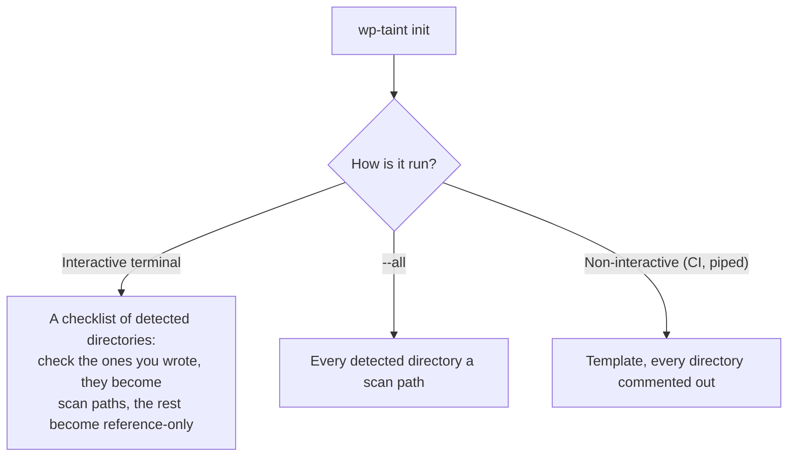

# Getting started

Install wp-taint, scan a plugin, and read your first finding. Takes about five
minutes.

**Prerequisites:** PHP 8.2 or newer, and Composer.

## Install

```bash
composer require --dev enshrined/wp-taint
```

`ext-pcntl` is optional. Without it `--jobs` is capped at 1 and everything else
works.

## Set up a WordPress project

Point `init` at your `wp-content` and it detects the themes and plugins, then
writes a `wp-taint.toml`. What it writes depends on how you run it:



```bash
vendor/bin/wp-taint init /path/to/wp-content
```

In CI or piped, it writes the template rather than hanging on the prompt.
Uncomment the directories you wrote, then scan with no arguments:

```bash
vendor/bin/wp-taint scan
```

## Run your first scan

Or point it straight at a directory:

```bash
vendor/bin/wp-taint scan ./src
```

wp-taint analyses the whole tree as one program, then reports what it found:

```
HIGH      wp.xss.unescaped-output
  includes/class-report-renderer.php:47:10  echo $this->build_header( $filter );

    source    :42:24  $filter = wp_unslash( $_GET['report_filter'] );
    sink      :47:10  echo $this->build_header( $filter );

  Untrusted input reaches output without HTML escaping.
  Run with --verbose for the full path.
─────────────────────────────────────────────────────────────
  0 critical   1 high   0 medium   0 low
  1 finding in 1 file · 18 files scanned · 0.2s
─────────────────────────────────────────────────────────────
```

## Read a finding

Every finding has the same five parts.

| Part | Example | What it tells you |
|------|---------|-------------------|
| Severity | `HIGH` | How much to care |
| Rule | `wp.xss.unescaped-output` | What kind of bug |
| Location | `class-report-renderer.php:47:10` | Where to fix it |
| Source | `:42:24 $_GET['report_filter']` | Where the value came from |
| Sink | `:47:10 echo ...` | Where it does damage |

The source line is the point of the tool. A finding without one is a shape the
engine could not prove is dangerous; a finding with one is a value it traced
from the request to the output, across functions and files.

Add `--verbose` for every step in between, including the escaping that was
applied and the call that undid it.

## Ask why

`explain` answers "why is this value tainted" and, just as usefully, "why was
this *not* flagged":

```bash
vendor/bin/wp-taint explain ./src/includes/class-report-renderer.php:47 --scope=./src
```

`explain` is a command, not a scan flag. `--scope` is not optional: without it
the file is analysed alone, and anything whose taint arrives through an include
or a hook comes back clean.

## Fix it, or record why not

Escaping at the point of output is the fix for the example above:

```php
echo esc_html( $this->build_header( $filter ) );
```

When a finding is wrong or accepted, suppress it in the code with a reason:

```php
// wp-taint-ignore-next-line wp.xss.unescaped-output -- output is admin-only, reviewed 2026-08
echo $header;
```

For an existing codebase, take a baseline instead of suppressing line by line:

```bash
vendor/bin/wp-taint scan ./src --generate-baseline=wp-taint-baseline.json
vendor/bin/wp-taint scan ./src --baseline=wp-taint-baseline.json
```

Everything in the baseline is silenced. Anything new is reported, which is what
makes the tool useful on day one of a codebase that has never been scanned.

## Add it to CI

```bash
vendor/bin/wp-taint scan ./src --fail-on=high
```

Exit codes:

| Code | Meaning |
|------|---------|
| 0 | No findings at or above `--fail-on` |
| 1 | Findings at or above `--fail-on` |
| 2 | Execution error, including any file that failed to parse |

A file that will not parse is an error rather than a silent skip, so a scan
never passes by looking at less than you think.

## Next steps

- [Scan your own code inside a WordPress install](scanning-a-wordpress-project.md)
  when your plugin lives among a hundred others
- [How it works](how-it-works.md) for the model behind the findings
- [CLI reference](cli-reference.md) for every command and option
- [Troubleshooting](troubleshooting.md) when a scan looks stuck or says too much
