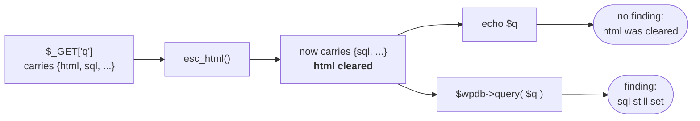

# How wp-taint decides something is a bug

wp-taint follows values. A finding means a specific value reached a specific
place, and the trace is the evidence.

This explains the model behind the findings. For behaviour at the edges, see
[Known limitations](../KNOWN_LIMITATIONS.md).

## Sources, sinks and the path between

Three ideas carry the whole tool.

- A **source** produces a value someone outside your code chose. `$_GET`, a REST
  parameter, a database row.
- A **sink** is somewhere a value does damage. `echo`, a `$wpdb` query,
  `unserialize()`, `include`.
- A **sanitizer** makes a value safe, for a stated purpose.

A finding is a source reaching a sink with nothing in between that made it safe.

The path is what separates this from a pattern matcher. It crosses function
boundaries, files, includes and hook dispatches, so the source and the sink are
usually nowhere near each other:

```php
// includes/request.php
function acme_filter() {
    return wp_unslash( $_GET['report_filter'] );
}

// includes/render.php
function acme_header( $filter ) {
    return '<h2>' . $filter . '</h2>';
}

echo acme_header( acme_filter() );   // reported here
```

## Taint is a set, never a boolean

A value is not "tainted" or "clean". It carries a set of kinds, and each kind is
a different claim.

`esc_html()` makes a value safe to print in HTML. It does nothing to make it
safe in a SQL query. `esc_sql()` is the reverse, and safe only inside quotes.
Collapsing those into one flag means either missing real bugs or reporting safe
code, and there is no threshold that avoids both.

So `esc_html()` clears the HTML kind and leaves the rest. A value that has been
through it is reported at a database sink and not at an echo, which is the
correct answer to both questions:



## Storing and printing are different obligations

WordPress asks for two things and they are not the same.

```php
update_option( 'endpoint', esc_url_raw( wp_unslash( $_POST['endpoint'] ) ) );
```

`esc_url_raw()` is exactly right for storing a URL and exactly wrong for
printing one. The input obligation is *sanitise before it is stored*; the output
obligation is *escape at the point of output*. They are tracked separately,
which is why `trim()` and `wp_unslash()` do not count as sanitising: they clean
nothing.

You do not have to connect the two to have a bug. An attacker who can write
arbitrary data into an option has a problem worth reporting, whether or not the
tool can also prove where it is later printed.

## Escaping has to survive to the output

Escaping early and filtering afterwards is the same as not escaping.

```php
$safe = esc_html( $value );
echo apply_filters( 'acme_label', $safe );   // a plugin can return anything
```

Anything a third party can hook stands between the escaper and the sink, so the
guarantee the escaper gave does not survive it. That is `apply_filters()`
itself, and equally the several hundred core functions that run a filter and
return the result. `get_the_title()` looks like an accessor and is a filter in a
coat.

`wp_sprintf()` is the one that catches people:

```php
$_fragment = apply_filters( 'wp_sprintf', $fragment, $arg );
if ( $_fragment !== $fragment ) {
    $fragment = $_fragment;      // the callback's return, used verbatim
}
```

The fix is always the same: escape after the last thing that can change the
value, not before it.

## Escaping is judged against where it lands

`esc_attr()` in an `href` does not stop `javascript:`. `esc_html()` inside a
`<script>` block does not stop a string breakout. The engine reads the markup
around the output and checks the escaper against the context it actually lands
in, down to the quote character:

```php
echo '<a href="' . esc_url_raw( $u ) . '">';   // safe: no quote can survive
echo "<a href='" . esc_url_raw( $u ) . "'>";   // unsafe: an apostrophe can
```

## Two questions, and which one is asked

wp-taint asks: **is this value proven safe?** Everything with a traced path is
reported for what that path shows, and output that nothing vouches for is
reported at `low`.

That second half is WordPress's own standard: escape on output wherever the
value came from. It applies to parameters of functions nothing in the scan
calls, because those arrive from outside and the scan has read nothing that
settles them. A parameter whose callers *are* visible is not unknown, because
the caller answers for it.

`low` is below the default `--fail-on`, so it cannot fail a build on its own. A
reader who knows the value is safe dismisses it in a second; a reader who is
never shown it cannot.

`--no-unknown-provenance` asks the narrower question, **can I trace this value
back to something dangerous?**, and reports only what has a path.

## Some functions are entry points

Nothing in your plugin calls a hook callback, a shortcode handler or a REST
endpoint. WordPress does, and it hands them data someone else chose.

```php
add_shortcode( 'badge', 'acme_badge' );

function acme_badge( $atts ) {
    return '<span style="color:' . $atts['color'] . '">x</span>';   // reported
}
```

`$atts` comes from the post body, so it carries the same taint an option does.
The return is the output, because `do_shortcode()` prints it and there is no
`echo` in the plugin to find.

A dynamic block's `render_callback` is the same shape and is treated the same
way. Its parameters are not seeded, though: a block's inner content is
already-rendered markup meant to be printed as it is.

A closure is the other half of the same problem. Its body is a separate
function, so what it captured has to be carried across:

```php
$raw = $_GET['msg'] ?? '';
add_action( 'wp_footer', function () use ( $raw ) {
    echo $raw;                     // reported
} );
```

## Structural rules, for what dataflow cannot see

Some bugs are not about a value at all. An AJAX handler with no capability check
is a bug because of what is *missing*, and no amount of following values finds
an absence.

`register_setting()` with no `sanitize_callback` is the same idea from the input
side: core reads `$_POST` and core writes the option, so the plugin's only
involvement is the registration, and there is no flow to follow.

Those run as separate rules over the syntax, and they are reachability
questions rather than name matching. "Does this callback reach a capability
check, through however many helpers" is answered by walking the call graph,
which is what credits a helper for the right reason: `acme_verify_ajax()` counts
because it calls `wp_verify_nonce()`, which the engine can see.

## The catalogue is data

Which functions are sources, sinks and sanitizers is a TOML catalogue, not code.
Adding a function is an entry, never a patch:

```toml
[[sanitizers]]
function = "acme_escape_slug"
clears = ["html", "html_attr"]
```

Unknown keys are a hard error, so a typo is a failed load rather than a rule
that silently never fires.

Two parts of the catalogue are generated from WordPress itself and checked for
drift in CI: the escaper list, cross-checked against the WordPress Coding
Standards sniffs, and the list of core functions that return filtered content.

## What it deliberately does not do

- **No network, no LLM, no telemetry.** Analysis is deterministic and offline.
  The same input gives the same output, on any machine.
- **No silent skips.** A file that will not parse is exit code 2, not a gap.
- **No guessing.** An unmodelled function returns clean rather than a guess, and
  a value the engine cannot account for is said to be unaccounted for rather
  than assumed either way.

## Related

- [Known limitations](../KNOWN_LIMITATIONS.md), the honest edges
- [Benchmark](benchmark.md), scored against other tools
- [Tuning log](tuning.md), every false positive class found and what fixed it
