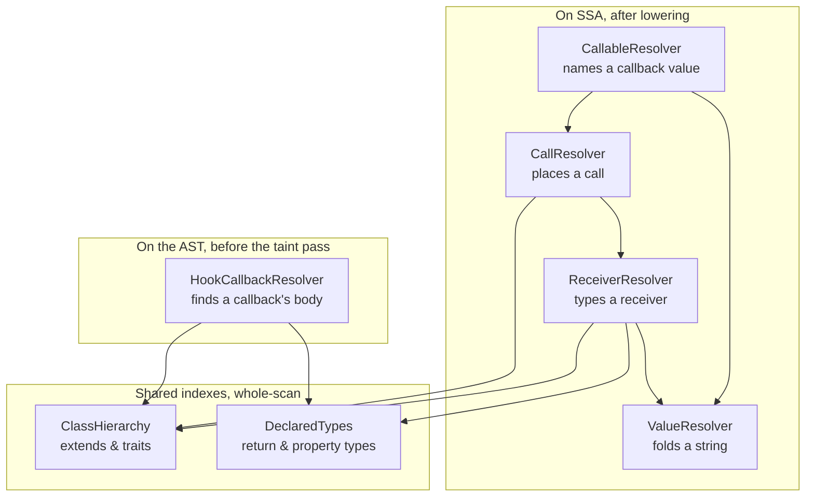

# How wp-taint resolves a name

Five classes answer some version of "what does this name mean". This maps who
answers what, so the next change to name resolution knows where it belongs, and
does not fix one resolver while another keeps the bug, which has happened twice.

> This is a contributor document. It describes the engine's internals, not how
> to use the tool.

## The five resolvers

| Class | Question it answers | Reads |
|-------|--------------------|-------|
| `ValueResolver` | What string(s) can this operand be? | SSA operands, the constant table, templated returns, theme roots |
| `CallResolver` | What does this call site resolve to (a user function, a catalogue entry, or nothing)? | The call op, plus `ReceiverResolver` for a method's class |
| `CallableResolver` | What function does this *callback value* name? | A callable passed to `add_action`, `array_map`, `call_user_func` |
| `ReceiverResolver` | What class is this method call's receiver? | `$this`, `new`, declared types, the `$wpdb`/`$db` convention |
| `HookCallbackResolver` | What is a hook callback's body, from the AST alone? | One file's AST, for structural rules that run before the taint pass |

They form two layers on the SSA side and one apart on the AST side, over two
shared indexes. The arrows are "delegates to":

## Why there are five, not one

Two axes divide them, and the divisions are real rather than accidental.

**AST versus SSA.** `HookCallbackResolver` works on the raw syntax tree because
the structural rules run before the CFG is analysed and the AST is released.
Everything else works on SSA operands, after lowering. These two genuinely
cannot share code: they operate on different representations of the program.

**Value versus call versus receiver.** Among the SSA resolvers, the split is by
what is being named. `ValueResolver` folds a string; `CallResolver` places a
call; `ReceiverResolver` types a receiver so `CallResolver` can place a method
call. They call each other in that order (a method call is resolved by typing
its receiver, which may require folding a value), so they are layers, not
duplicates.

`CallableResolver` is the odd one: a callback value is a string or an array that
*names* a function without calling it, so it sits between `ValueResolver` (which
folds the string) and `CallResolver` (which would place the call).

## Where the seams leak

The divisions are sound, but the same fix has had to be applied in more than one
place:

- **A computed method name** (`$m = 'verify'; $this->$m()`) needed the same
  "fold to one string" logic in `CallResolver::resolveMethodCall` that
  `ValueResolver` already had. The fix was to have `CallResolver` *call*
  `ValueResolver`, not reimplement it.
- **A cross-file class** needed the project-wide `DeclaredTypes` index in both
  `ReceiverResolver` (for the SSA path) and `HookCallbackResolver` (for the AST
  path). Because they are different representations, both had to learn it
  separately, which is the AST/SSA split working as intended, not a defect.

The rule the seams teach: **when a resolver cannot answer, it should delegate to
the resolver whose job that sub-question is, never reimplement it.** A value
question goes to `ValueResolver`; a type question goes to `ReceiverResolver` or
`DeclaredTypes`. The layering already expresses this; new code should follow it.

## `DeclaredTypes` and `ClassHierarchy`, the shared indexes

`DeclaredTypes` is not a resolver, it is a project-wide table of what the code
declares about itself (return types, property types, promoted parameters,
`$this->x = new Foo()`), built once with the function table. Both
`ReceiverResolver` and `HookCallbackResolver` consult it, which is how a class
declared in one file is known in another. When a resolution question is
"what type is this, across the whole scan", the answer lives here rather than in
any one resolver.

`ClassHierarchy` is the same shape of thing for inheritance: who extends whom
and who uses which trait, built on the same walk. `lookupOrder()` answers
"where would PHP find this member?" in PHP's own precedence order (the class,
its traits, the parent, the parent's traits, and up), and everything that used
to do a flat `Class::method` or `class::property` lookup walks it instead:
`UserFunctionTable::resolveMethodKey()` (which `CallResolver` and
`CallableResolver` resolve through), `DeclaredTypes::propertyClassOf()`,
`OriginClassifier`'s property-taint check, and the structural rules via
`RuleContext::canonicalCallbackKey()`. The same delegation rule applies: a
"who defines this member" question goes to the hierarchy, never to a
reimplemented walk.

## If these are ever merged

Not now: the AST/SSA split is fundamental and the value/call/receiver layering
is load-bearing. The realistic consolidation, when one of them next needs
surgery, is to make every "fold a value" call route through `ValueResolver` and
every "type a receiver" call route through `ReceiverResolver` + `DeclaredTypes`,
so the two SSA seams have exactly one implementation each. That is a
simplification of the call sites, not a rewrite of the classes.
